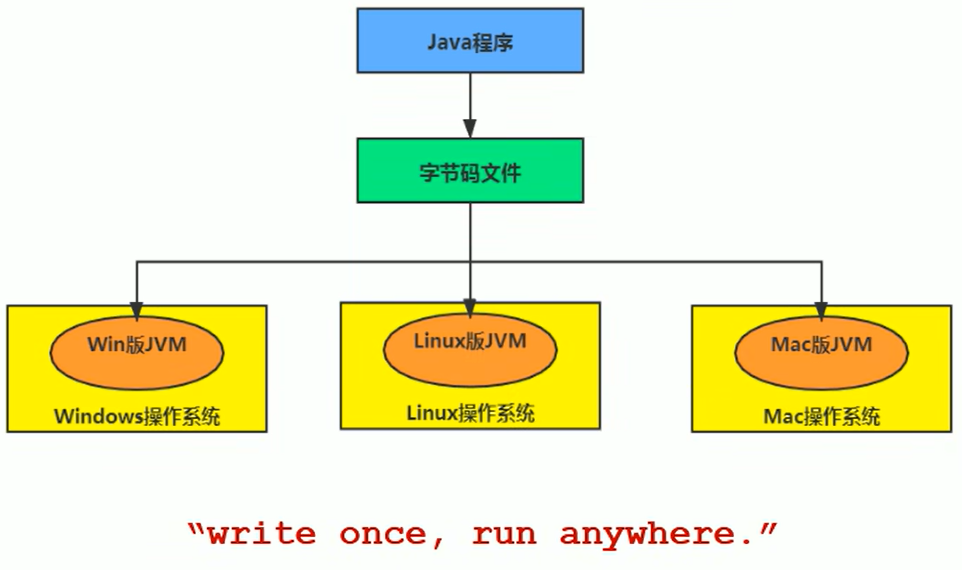
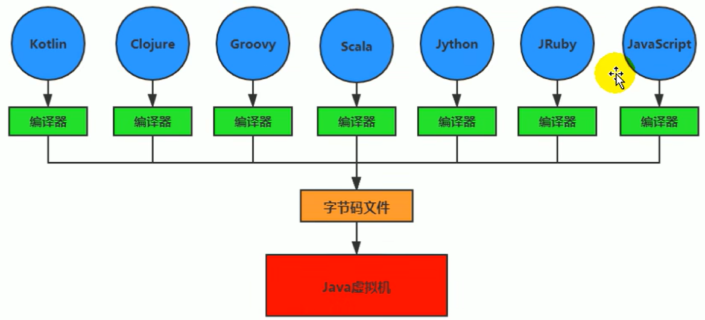
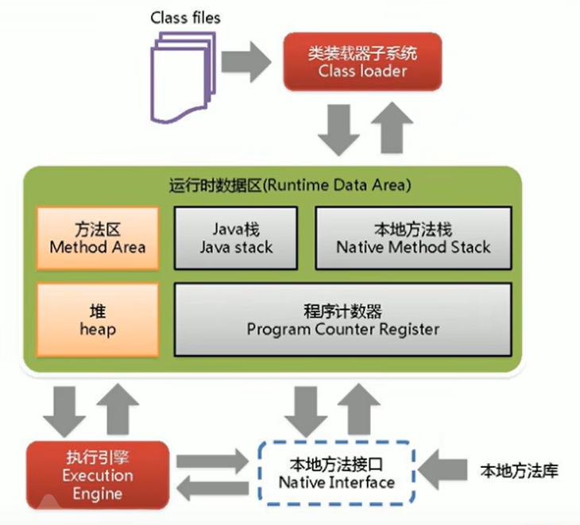

# [视频连接](https://www.bilibili.com/video/BV1PJ411n7xZ/?spm_id_from=333.337.search-card.all.click&vd_source=87f168d5f6bd2eb6e55e81b9f6e63e79)

# 参考书目
官方文档, 周志明老师的书

# Java及JVM简介

# 6.JVM的整体结构 (HotSpot)

# 7.Java代码执行流程
# 8.JVM的架构模型
# 9.JVM的生命周期
虚拟机的启动: 通过引导类加载器(bootstrap class )
虚拟机的执行:  
虚拟机的退出:
# 10.JVM的发展历程