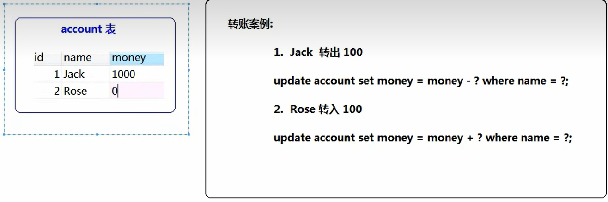
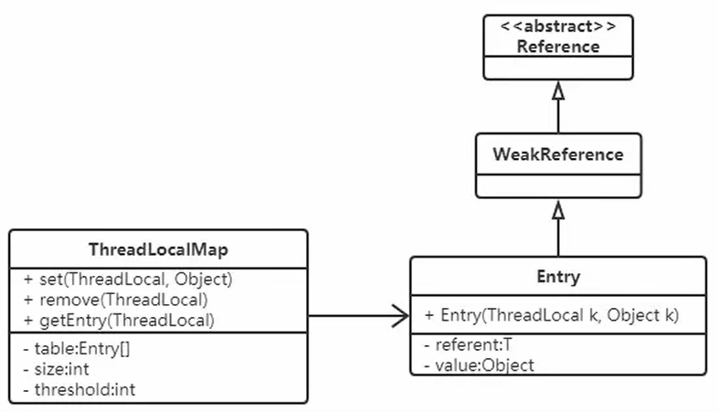
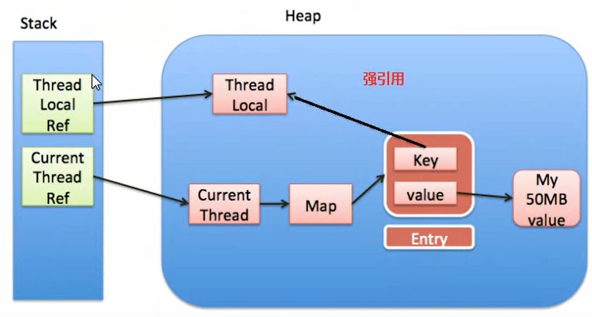
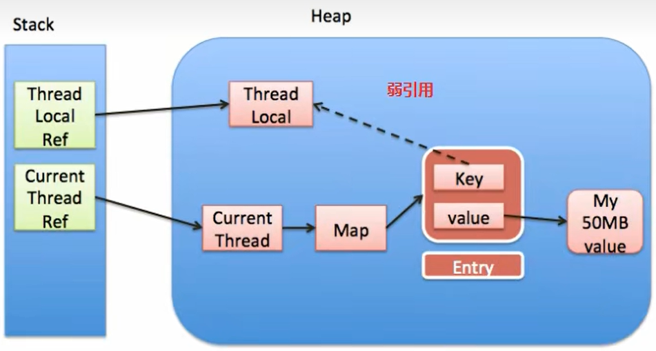

# ThreadLocal
## 1. 基本使用
### 1.1 常用方法
|方法声明|描述|
|--|--|
|ThreadLocal()|创建ThreadLocal对象|
|public void set(T value) | 设置当前线程绑定的局部变量|
|public T get()|获取当前线程绑定的局部变量|
|public void remove()|移除当前线程绑定的局部变量|
### 1.2 使用案例
需求: 线程隔离<br>
在多线程并发的场景下, 要求每个线程中的变量都相互独立的<br>
线程A: 设置(变量1) 获取(变量1)<br>
线程B: 设置(变量2) 获取(变量2)<br>

以下代码存在什么问题?
```java
class Main {
    private String content;

    private String getContent() {
        return content;
    }

    private void setContent(String content) {
        this.content = content;
    }

    public static void main(String[] args) {
        Main main = new Main();
        for (int i = 0; i < 5; ++i) {
            Thread thread = new Thread(new Runnable() {
                @Override
                public void run() {
                    /**
                     * 每个线程, 存一个变量, 过一会, 取出这个变量
                     */
                    main.setContent(Thread.currentThread().getName() + "的数据");
                    System.out.println("-------------------");
                    System.out.println(Thread.currentThread().getName() + "--->" + main.getContent());
                }
            });
            thread.setName("线程" + i); // 线程0-4
            thread.start();
        }
    }
}
```
改进后代码
```java
class Main {
    ThreadLocal<String> threadLocal = new ThreadLocal<>();

    private String getContent() {
        return threadLocal.get();
    }

    private void setContent(String content) {
        // 变量content绑定到当前线程
        threadLocal.set(content);

    }

    public static void main(String[] args) {
        Main main = new Main();
        for (int i = 0; i < 5; ++i) {
            Thread thread = new Thread(new Runnable() {
                @Override
                public void run() {
                    /**
                     * 每个线程, 存一个变量, 过一会, 取出这个变量
                     */
                    main.setContent(Thread.currentThread().getName() + "的数据");
                    System.out.println("-------------------");
                    System.out.println(Thread.currentThread().getName() + "--->" + main.getContent());
                }
            });
            thread.setName("线程" + i); // 线程0-4
            thread.start();
        }
    }
}
```
### 1.3 ThreadLocal类与synchronized关键字
#### 1.3.1 synchronized同步方式
以下使用synchronized关键字也可以解决问题, 但我们强调的是线程隔离问题, 并不是多线程共享数据的问题, 在这个案例中使用synchronized关键字是不合适的
```java
class Main {
    private String content;

    private String getContent() {
        return content;
    }

    private void setContent(String content) {
        this.content = content;
    }

    public static void main(String[] args) {
        Main main = new Main();
        for (int i = 0; i < 5; ++i) {
            Thread thread = new Thread(new Runnable() {
                @Override
                public void run() {
                    /**
                     * 每个线程, 存一个变量, 过一会, 取出这个变量
                     */
                    synchronized (Main.class) {
                        main.setContent(Thread.currentThread().getName() + "的数据");
                        System.out.println("-------------------");
                        System.out.println(Thread.currentThread().getName() + "--->" + main.getContent());
                    }
                }
            });
            thread.setName("线程" + i); // 线程0-4
            thread.start();
        }
    }
}
```

#### 1.3.2 ThreadLocal与synchronized的区别
虽然ThreadLocal模式与synchronized关键字都用于处理多线程并发访问变量的问题, 不过两者处理问题的角度和思路不同

||synchronized|ThreadLocal|
|--|--|--|
|原理|同步机制采用<font color=red>"以时间换空间"</font>的方式, 只提供了一份变量, 让不同的线程排队访问|ThreadLocal采用<font color=red>"以空间换时间"</font>的方式, 为每一个线程都提供了一份变量的副本, 从而实现同时访问而互不干扰|
|侧重点|多个线程之间访问资源的同步|多线程中让每个线程之间的数据相互隔离|

```
总结: 在刚才的案例中, 虽然使用ThreadLocal和synchronized都能解决问题, 但是使用ThreadLocal更为合适, 因为这样可以使程序拥有更高的并发性
```

## 2. 运用场景-事务案例
通过以上介绍, 我们已经基本了解ThreadLocal的特点. 但是它具体是运用在什么场景中呢? 接下来让我们看一个案例: 事务操作.
### 2.1 转账案例
#### 2.1.1 场景构建

这里我们先构建一个简单的转账场景: 有一个数据表account, 里面有两个用户Jack和Rose, 用户Jack给Rose转账<br> 
案例的实现主要用mysql数据库, JDBC和C3P0框架. 以下是详细代码:

dao层
```java
public class AccountDao {
    // 转出
    public void out(String outUser, int money) throws SQLException {
        String sql = "update account set money = money - ? where name = ?";

        Connection conn = JdbcUtils.getConnection();
        PreparedStatement ps = conn.prepareStatement(sql);
        ps.setInt(1, money);
        ps.setString(2, outUser);
        ps.executeUpdate();

        JdbcUtils.release();
    }

    // 转入
    public void in(String inUser, int money) throws SQLException {
        String sql = "update account set money = money + ? where name = ?";

        Connection conn = JdbcUtils.getConnection();
        PreparedStatement ps = conn.prepareStatement(sql);
        ps.setInt(1, money);
        ps.setString(2, inUser);
        ps.executeUpdate();

        JdbcUtils.release();
    }
}
```

service层
```java
public class AccountService {
    // 转账
    public boolean transfer(String outUser, String inUser, int money) {
        AccountDao ad = new AccountDao();
        try {
            // 转出
            ad.out(outUser, money);
            // 转入
            ad.out(inUser, money);
        } catch (SQLException e) {
            e.printStackTrace();
            return false;
        }
        return true;
    }
}
```
util层
```java
public class JdbcUtils {
    // c3p0 数据库连接池对象属性(还可以使用DBCP, Druid, HikariCP等JDBC 连接池实现)
    private static final ComboPooledDataSource ds = new ComboPooledDataSource();

    // 获取连接
    public static Connection getConnection() throws SQLException {
        return ds.getConnection();
    }

    // 释放资源
    public static void release(AutoCloseable... ios) {
        for(AutoCloseable io : ios) {
            if(io != null) {
                try {
                    io.close();
                } catch (Exception e) {
                    e.printStackTrace();
                }
            }
        }
    }

    public static void commitAndClose(Connection conn) {
        try {
            if (conn != null) {
                // 提交事务
                conn.commit();
                // 释放连接
                conn.close();
            }
        } catch (Exception e) {
            e.printStackTrace();
        }
    }

    public static void rollbackAndClose(Connection conn) {
        try {
            if(conn != null) {
                // 回滚事务
                conn.rollback();
                // 释放连接
                conn.close();
            }
        } catch (Exception e) {
            e.printStackTrace();
        }
    }
}
```

web层
```java
public class AccountWeb {
    public static void main(String[] args) {
        String outUser = "Jack";
        String inUser = "Rose";
        int money = 100;

        AccountService as = new AccountService();
        boolean result = as.transfer(outUser, inUser, money);

        if (!result) {
            System.out.println("转账失败");
        } else {
            System.out.println("转账成功");
        }
    }
}
```

#### 2.1.2 引入事务
案例中的转账涉及两个DML操作: 一个转出, 一个转入. 这些操作是需要具备原子性的, 不可分割, 不然就有可能出现数据修改异常情况
```java
public class AccountService {
    // 转账
    public boolean transfer(String outUser, String inUser, int money) {
        AccountDao ad = new AccountDao();
        Connection conn = null;
        try {
            // 开启事务
            conn = JdbcUtils.getConnection();
            conn.setAutoCommit(false);
            // 转出
            ad.out(outUser, money);
            // 转入
            ad.out(inUser, money);
            // 成功提交
            JdbcUtils.commitAndClose(conn);
        } catch (SQLException e) {
            e.printStackTrace();
            // 失败回滚
            JdbcUtils.rollbackAndClose(conn);
            return false;
        }
        return true;
    }
}
```
所以这里需要事务操作, 来保证转出和转入操作具备原子性, 要么同时成功,要么同时失败

(1) JDBC中关于事务的操作api
|Connection接口的方法|作用|
|--|--|
|void setAutoCommit(false)|禁用事务自动提交(改为手动)|
|void commit()|提交事务|
|void rollback()|回滚事务|

(2) 开启事务的注意点
- 为了保证所有的操作在一个事务中, 案例中使用的连接必须是同一个: service层开启事务的Connection需要跟dao层访问数据库的Connection保持一致
- 线程并发情况下, 每个线程只能操作各自的Connection
  
### 2.2 常规解决办法
#### 2.2.1 常规方案的实现

```java
/**
 * 事务使用注意:
 *                      1. service层和dao层的连接对象需要保持一致
 *                      2.每个线程的Connection对象必须前后一致, 线程隔离
 *  常规解决办法:
 *                      1. 传参: 将service层的Connection对象直接传递到dao层
 *                      2. 加锁
 *  弊端:
 *          1. 提高代码耦合度
 *          2. 降低程序性能
 */
public class AccountService {
    // 转账
    public boolean transfer(String outUser, String inUser, int money) {
        AccountDao ad = new AccountDao();
        Connection conn = null;
        try {
            synchronized (AccountService.class) {
                // 开启事务
                conn = JdbcUtils.getConnection();
                conn.setAutoCommit(false);
                // 转出
                ad.out(outUser, money, conn);
                // 转入
                ad.in(inUser, money, conn);
                // 成功提交
                JdbcUtils.commitAndClose(conn);
            }
        } catch (SQLException e) {
            e.printStackTrace();
            // 失败回滚
            JdbcUtils.rollbackAndClose(conn);
            return false;
        }
        return true;
    }
}
```
```java
/**
 *  常规方案:
 *                  1. 方法添加一个参数conn
 *                  2. 不能从连接池中获取连接, 直接使用参数conn
 *                  3. 注意: dao层不能释放连接
 */
public class AccountDao {
    // 转出
    public void out(String outUser, int money, Connection conn) throws SQLException {
        String sql = "update account set money = money - ? where name = ?";

//        Connection conn = JdbcUtils.getConnection();
        PreparedStatement ps = conn.prepareStatement(sql);
        ps.setInt(1, money);
        ps.setString(2, outUser);
        ps.executeUpdate();

//        JdbcUtils.release();
    }

    // 转入
    public void in(String inUser, int money, Connection conn) throws SQLException {
        String sql = "update account set money = money + ? where name = ?";

//        Connection conn = JdbcUtils.getConnection();
        PreparedStatement ps = conn.prepareStatement(sql);
        ps.setInt(1, money);
        ps.setString(2, inUser);
        ps.executeUpdate();

//        JdbcUtils.release();
    }
}
```

#### 2.2.2 ThreadLocal的实现
这种需要在项目中进行数据传递和线程隔离的场景, 我们不妨用ThreadLocal来解决


工具类修改: 加入ThreadLocal
```java
public class JdbcUtils {
    private static ThreadLocal<Connection> threadLocal = new ThreadLocal<>();

    // c3p0 数据库连接池对象属性(还可以使用DBCP, Druid, HikariCP等JDBC 连接池实现)
    private static final ComboPooledDataSource ds = new ComboPooledDataSource();

    /**
     * 获取连接
     * 原本: 直接从连接池中获取连接
     * 现在:
     *          1. 直接获取当前线程绑定的连接对象
     *          2. 如果连接对象是空的
     *              2.1 再去连接池中获取连接
     *              2.2 将此连接对象和当前线程绑定
     */
    public static Connection getConnection() throws SQLException {
        Connection conn = threadLocal.get();
        if(conn == null) {
            conn = ds.getConnection();
            threadLocal.set(conn);
        }
//        return ds.getConnection();
        return conn;
    }
}
```

#### 2.2.3 ThreadLocal方案的好处
从上述案例中我们可以看到, 在一些特定场景下, ThreadLocal方案有两个突出的优势:
1. 传递数据: 保存每个线程绑定的数据, 在需要的地方可以直接获取, 避免参数直接传递带来的代码耦合度问题
2. 线程隔离: 各线程之间的数据相互隔离却又具备并发性, 避免同步方式带来的性能损失

## 3. ThreadLocal的内部结构
通过以上的学习, 我们对ThreadLocal的作用有了一定的认识. 现在让我们一起来看一下ThreadLocal的内部结构, 探究它能够实现线程数据隔离的原理

### 3.1 常见误解
如果我们不去看源码的话, 可能会猜测ThreadLocal是这样子设计的: 每个ThreadLocal都创建一个Map, 然后用线程作为Map的key, 要存储的局部变量作为Map的value, 这样就能达到各个线程的局部变量隔离效果. 这是最简单的设计方法. jdk最早期的ThreadLocal确实是这样设计的, 但是现在早已不是了.


### 3.2 现在的设计
但是, JDK后面优化了方案, 在JDK8中ThreadLocal的设计是: 每个Thread维护一个ThreadLocalMap, 这个Map的key是ThreadLocal实例本身, value才是真正要存储的值Object.

具体过程是这样的:
- 每个Thread线程内部都有一个Map(ThreadLocalMap)
- Map里存储ThreadLocal对象(key)和线程的变量副本(value)
- Thread内部的Map是由ThreadLocal维护的, 由ThreadLocal负责向Map获取和设置线程的变量值
- 对于不同的线程, 每次获取副本值时, 别的线程并不能获取到当前线程的副本值, 形成了副本的隔离, 互不干扰


JDK8这样设计好处:
1. 每个Map存储的Entry数量变少
2. 当Thread销毁的时候, ThreadLocalMap也会随之销毁, 减少内存的使用

## 4. ThreadLocal的核心方法源码
基于ThreadLocal的内部结构, 我们继续分析它的核心方法源码, 更深入的了解其操作原理.
除了构造方法之外, ThreadLocal对外暴露的方法有以下4个:

|方法声明|描述|
|--|--|
|protected initialValue()| 返回当前线程局部变量的初始值|
|public void set(T value)| 设置当前线程绑定的局部变量|
|public void get()| 获取当前线程绑定的局部变量|
|public void remove()|移除当前线程绑定的局部变量|

以下是这4个方法的详细源码分析(为了保证思路清晰, ThreadLocalMap部分暂时不展开)

### 4.1 set方法
```java
public void set(T value) {
    // 1. 获取当前线程对象
    Thread t = Thread.currentThread();
    // 2. 获取此线程对象中维护的ThreadLocalMap对象
    ThreadLocalMap map = getMap(t);
    // 3. 判断map是否存在
    if (map != null)
        // 存在则调用map.set设置此实体entry
        map.set(this, value);
    else
        // 1)当前线程Thread不存在ThreadLocalMap对象
        // 2)则调用createMap进行ThreadLocalMap的初始化
        // 3)并将t(当前线程)和value(t对应的值)作为第一个entry存放至ThreadLocalMap中
        createMap(t, value);
}

ThreadLocalMap getMap(Thread t) {
    return t.threadLocals;
}

void createMap(Thread t, T firstValue) {
    t.threadLocals = new ThreadLocalMap(this, firstValue);
}
```

set执行流程:
- 首先获取当前线程, 并根据当前线程获取一个Map
- 如果获取的Map不为空, 则将参数设置到Map中(当前ThreadLocal的引用作为key)
- 如果Map为空, 则给该线程创建Map, 并设置初始值

### 4.2 get方法
```java
public T get() {
    Thread t = Thread.currentThread();
    ThreadLocalMap map = getMap(t);
    if (map != null) {
        ThreadLocalMap.Entry e = map.getEntry(this);
        if (e != null) {
            @SuppressWarnings("unchecked")
            T result = (T)e.value;
            return result;
        }
    }
    return setInitialValue();
}

private T setInitialValue() {
    T value = initialValue();
    Thread t = Thread.currentThread();
    ThreadLocalMap map = getMap(t);
    if (map != null)
        map.set(this, value);
    else
        createMap(t, value);
    return value;
}
```

get执行流程:
- A. 首先获取当前线程, 根据当前线程获取一个Map
- B. 如果获取的Map不为空, 则在Map中以ThreadLocal的引用作为key来在Map中获取对应的Entry, 否则转到D
- C. 如果e不为null, 则返回e.value, 否则转到D
- D. Map为空或者e为空, 则通过initialValue函数获取初始值value, 然后用ThreadLocal的引用和value作为firstKey和firstValue创建一个新的Map

总结: <b>先获取当前线程的ThreadLocalMap变量, 如果存在则返回值, 不存在则创建并返回初始值</b>

### 4.3 remove方法
```java
public void remove() {
    ThreadLocalMap m = getMap(Thread.currentThread());
    if (m != null)
        m.remove(this);
}
```
remove执行流程:
- A.首先获取当前线程, 并根据当前线程获取一个Map
- B.如果获取的Map不为空, 则移除当前的ThreadLocal对象对应的entry

### 4.4 initialValue方法
```java
protected T initialValue() {
    return null;
}
```
此方法的作用是: 返回该线程局部变量的初始值

(1) 这个方法是一个延迟调用方法, 从上边的代码我们得知, 在set方法还未调用而先调用了get方法时才执行, 并且仅执行一次<br>
(2) 这个方法的缺省实现是直接返回一个null<br>
(3) 如果想要一个除了null之外的初始值, 可以重写这个方法(备注: 该方法是一个protected的方法, 显然是为了让子类覆盖而设计的)

## 5. ThreadLocalMap源码分析
在分析ThreadLocal方法时, 我们了解到ThreadLocal的操作实际上是围绕ThreadLocalMap展开的.<br>
ThreadLocalMap的源码相对比较复杂, 我们从以下三个方面进行讨论.

### 5.1 基本结构
ThreadLocalMap是ThreadLocal的内部类, 没有实现Map接口, 用独立的方式实现了Map的功能, 其内部的Entry也是独立实现的.



#### 5.1.1 成员变量
```java
private static final int INITIAL_CAPACITY = 16;

private Entry[] table;

private int size = 0;

private int threshold;
```
跟HashMap类似<br>
INITIAL_CAPACITY 代表这个Map的初始容量;<br>
table 是一个Entry类型的数组, 用于存储数据;<br>
size 代表表中的存储数目;<br>
threshold 代表需要扩容时对应size的阈值<br>

#### 5.1.2 存储结构-Entry
```java
static class Entry extends WeakReference<ThreadLocal<?>> {
    /** The value associated with this ThreadLocal. */
    Object value;

    Entry(ThreadLocal<?> k, Object v) {
        super(k);
        value = v;
    }
}
```
ThreadLocalMap中, 也是用Entry来保存K-V结构数据的. 不过Entry中的key只能是ThreadLocal对象, 这点在构造方法中已经限定死了.

另外, Entry继承WeakReference, 也就是key(ThreadLocal)是弱引用, 其目的是将ThreadLocal对象的生命周期和线程生命周期解绑.

### 5.2 弱引用和内层泄露
有些程序员在使用ThreadLocal的过程中会发现有内存泄露的情况发生, 就猜测这个内存泄露跟Entry中使用了弱引用的key有关, 这个理解其实是不对的

我们先来回顾这个问题中涉及的几个概念, 再来分析问题

#### 5.2.1 内层泄露相关概念
- Memory overflow: 内存溢出, 没有足够的内存提供申请者使用.
- Memory leak: 内层泄露, 程序中已动态分配的堆内存由于某种原因程序未释放或无法释放, 造成系统内存的浪费, 导致程序运行速度减慢甚至系统崩溃等严重后果. 内存泄露的堆积终将导致内存溢出.

#### 5.2.2 弱引用相关概念

java中的引用有4种类型, 强, 软, 弱, 虚. 当前这个问题主要涉及到强引用和弱引用
- <b>强引用(Strong Reference)</b>: 我们常见的普通对象引用, 只要还有强引用指向一个对象, 就能表明对象还活着, 垃圾回收器就不会回收这种对象
- <b>弱引用(Weak Reference)</b>: 垃圾回收器一旦发现了只具有弱引用的对象, 不管当前内存空间足够与否, 都会回收它的内存
  
#### 5.2.3 如果key使用强引用

假设ThreadLocalMap中的key使用了强引用, 那么会出现内层泄露吗?<br>

此时ThreadLocal的内存图(实线表示强引用)如下:


1. 假设在业务代码中使用完ThreadLocal, ThreadLocal Ref被回收了
2. 但是因为ThreadLocalMap的Entry强引用了ThreadLocal, 造成ThreadLocal无法被回收
3. 在没有手动删除这个Entry以及CurrentThread依然运行的前提下, 始终有强引用链CurrentThreadRef -> CurrentThread -> ThreadLocalMap -> Entry, Entry就不会被回收(Entry中包含了ThreadLocal实例和value), 导致Entry内层泄露

也就是说, ThreadLocalMap中的key使用了强引用, 是无法完全避免内存泄露的

#### 5.2.4 如果key使用弱引用

假设ThreadLocalMap中的key使用了弱引用, 那么会出现内层泄露吗?<br>

此时ThreadLocal的内存图(虚线表示弱引用)如下:


1. 同样假设在业务代码中使用完ThreadLocal, ThreadLocal Ref被回收了
2. 由于ThreadLocalMap只持有ThreadLocal的弱引用, 没有任何强引用指向ThreadLocal实例,所以ThreadLocal就可以顺利被gc回收, 此时Entry中的key=null
3. 但是在没有手动删除这个Entry以及CurrentThread依然运行的前提下, 也存在有强引用链 CurrentThreadRef -> CurrentThread -> ThreadLocalMap -> Entry -> value, value不会被回收, 而这块value永远也不会被访问到了, 导致value内层泄露

也就是说, ThreadLocalMap中的key使用了弱引用, 也有可能内层泄露

#### 5.2.5 出现内存泄露的真正原因
比较以上两种情况, 我们会发现, 内层泄露的发生和ThreadLocalMap中的key是否是强引用和弱引用无关

那么内存泄露的真正原因是什么?

细心的同学会发现, 在以上两种内存泄露的情况中, 都有两个前提:
1. 没有手动删除这个Entry
2. CurrentThread依然运行

第一点很好理解, 只要在使用完ThreadLocal, 调用其remove方法删除对应的Entry, 就能避免内层泄露

第二点稍微复杂点, 由于ThreadLocalMap是Thread的一个属性, 被当前线程所引用, 所以它的生命周期跟Thread一样长. 那么在使用完ThreadLocal, 如果当前线程也随之执行结束, ThreadLocalMap自然也会被gc回收, 从根源上避免了内存泄露

综上, ThreadLocal内存泄露的根本原因是: 由于ThreadLocalMap的生命周期跟Thread一样长, 如果没有手动删除对应key就会导致内存泄露.

#### 5.2.6 为什么jdk8中使用弱引用
根据刚才的分析, 我们知道了: 无论ThreadLocalMap中key使用哪种引用类型, 都无法完全避免内存泄露, 跟使用弱引用没有关系

要避免内存泄露有两种方式:
1. 使用完ThreadLocal, 调用其remove方法删除对应的Entry
2. 使用完ThreadLocal, 当前Thread也随之运行结束

相对于第一种方式, 第二种方式显然更不好控制, 特别是使用线程池的时候, 线程结束是不会销毁的.

也就是说, 只要记得在使用完ThreadLocal及时的调用remove方法, 无论key是强引用还是弱引用都不会出现问题, 那么为什么key要使用弱引用呢?

事实上, 在ThreadLocalMap中的set/getEntry方法中, 会对key为null(也即ThreadLocal为null)进行判断, 如果为null的话, 那么会对value置为null的.

这就意味着, 使用完ThreadLocal, CurrentThread依然在运行的情况下, 就算忘记手动调用remove方法, 弱引用比强引用多一层保障: 弱引用的ThreadLocal会被回收, 对应的value在下一次ThreadLocalMap调用set,get,remove中的任一方法的时候会被清除, 从而避免内存泄露.

### 5.3 Hash冲突的解决
Hash冲突的解决是Map中的一个重要内容. 我们以Hash冲突的解决为线索, 来研究下ThreadLocalMap的核心源码
#### 5.3.1 从ThreadLocal的set方法入手
```java
public class ThreadLocal<T> {
    public void set(T value) {
        Thread t = Thread.currentThread();
        ThreadLocalMap map = getMap(t);
        if (map != null)
            map.set(this, value);
        else
            createMap(t, value);
    }

    ThreadLocalMap getMap(Thread t) {
        return t.threadLocals;
    }

    void createMap(Thread t, T firstValue) {
        t.threadLocals = new ThreadLocalMap(this, firstValue);
    }
}
```
这个方法我们刚才分析过, 其作用是设置当前线程绑定的局部变量:
- A.首先获取当前线程, 并根据当前线程获取一个map
- B.如果获取的map不为空, 则将参数设置到map中(当前ThreadLocal的引用作为key) (<b>这里调用了ThreadLocalMap的set方法</b>)
- C.如果获取的map为空, 则给该线程创建map, 并设置初始值 (<b>这里调用了ThreadLocalMap的构造方法</b>)

这段代码有两个地方分别涉及到ThreadLocalMap的两个方法, 我们接着分析这两个方法

#### 5.3.2 构造方法-ThreadLocalMap(ThreadLocal<?> firstKey, Object firstValue)

```java
public class ThreadLocal<T> {
    static class ThreadLocalMap {
        ThreadLocalMap(ThreadLocal<?> firstKey, Object firstValue) {
            table = new Entry[INITIAL_CAPACITY];
            int i = firstKey.threadLocalHashCode & (INITIAL_CAPACITY - 1);
            table[i] = new Entry(firstKey, firstValue);
            size = 1;
            setThreshold(INITIAL_CAPACITY);
        }
    }
}
```

构造函数首先创建一个长度为16的Entry数组,然后计算出firstKey对应的索引, 然后存储到table中, 并设置size和threshold

<b>重点分析</b>: 
```java
int i = firstKey.threadLocalHashCode & (INITIAL_CAPACITY - 1);
```

1. 关于firstKey.ThreadLocalHashCode:
   ```java
   public class ThreadLocal<T> {
        private static AtomicInteger nextHashCode =
        new AtomicInteger();

        private static final int HASH_INCREMENT = 0x61c88647;

        private static int nextHashCode() {
            return nextHashCode.getAndAdd(HASH_INCREMENT);
        }

        private final int threadLocalHashCode = nextHashCode();
   }
   ```
   这里定义了一个AtomicInteger类型, 每次获取当前值并加上HASH_INCREMENT.<br>
   HASH_INCREMENT = 0x61c88647, 这个值跟斐波那契数列(黄金分割数)有关, 其主要目的就是为了让Hash码能均匀的分布在2的n次方的数组里, 也就是Entry[] table中, 这样做可以尽量避免Hash冲突.<br>

2. 关于 & (INITIAL_CAPACITY - 1)
    
   计算Hash的时候里面采用了hashcode&(size-1)的算法, 这相当于取模运算hashcode%size的一个更高效的实现. <br>
   这是因为这种算法, 我们要求size必须是2的整数次幂, 这也能保证在索引不越界的前提下, 使得hash发生冲突的次数减小.

#### 5.3.3 ThreadLocalMap中的set方法
```java
public class ThreadLocal<T> {
    static class ThreadLocalMap {
        private void set(ThreadLocal<?> key, Object value) {
            Entry[] tab = table;
            int len = tab.length;
            int i = key.threadLocalHashCode & (len-1);
            // 使用线性探测法查找元素(重点代码)
            for (Entry e = tab[i];
                 e != null;
                 e = tab[i = nextIndex(i, len)]) {
                ThreadLocal<?> k = e.get();

                if (k == key) {
                    e.value = value;
                    return;
                }

                if (k == null) {
                    replaceStaleEntry(key, value, i);
                    return;
                }
            }

            tab[i] = new Entry(key, value);
            int sz = ++size;
            if (!cleanSomeSlots(i, sz) && sz >= threshold)
                rehash();
        }
    }
} 
```
