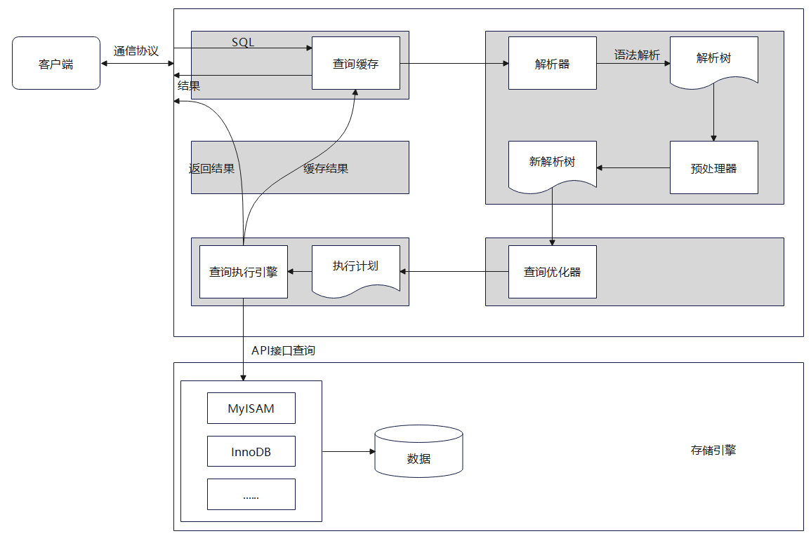

# 逻辑架构
## 1.逻辑架构剖析
## 2.SQL执行流程
### 2.1 MySQL中的SQL执行流程

#### MySQL的查询流程
1. 查询缓存(MySQL8.0之后抛弃了这个功能)
   查询缓存命中率过低, key是查询语句, value是查询结果
   查询缓存往往弊大于利, 查询缓存的失效非常频繁
2. 解析器: 在解析器中对SQL语句进行语法分析, 语义分析
3. 优化器: 一条查询可以有很多种执行方式, 最后都返回相同的结果, 优化器的作用就是找到其中最好的执行计划

## 3.数据库缓冲池(buffer pool)
