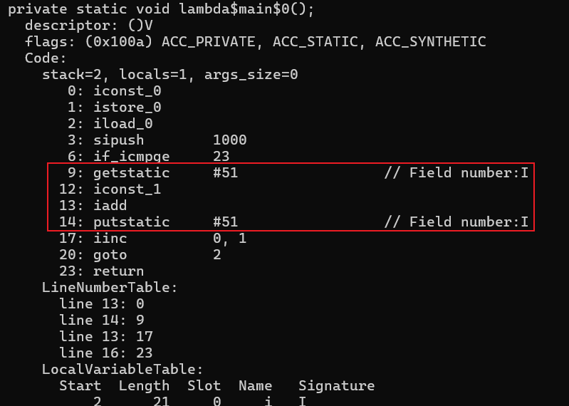

# 1. 并发编程中的三个问题
## 1.1 可见性
可见性(Visibility): 是指一个线程对共享变量进行修改, 另一个线程立刻得到修改后的最新值

代码示例:<br>
线程1根据boolean类型的标记flag, while循环<br>
线程2修改这个flag变量的值<br>
线程1会停止吗?
```java
public class Visibility {
    // 创建一个共享变量
    private static boolean flag = true;

    public static void main(String[] args) throws InterruptedException {
        // 创建一个线程不断读取共享变量
        new Thread(() -> {
            while (flag) {
                // 因为打印语句会线程切换,线程切换会导致缓存刷新
            }
        }).start();

        Thread.sleep(2000);

        // 创建一个线程修改共享变量
        new Thread(() -> {
            flag = false;
            System.out.println("线程2修改了变量的值为false");
        }).start();
    }
}
```
并发编程时, 会出现可见性问题, 当一个线程对共享变量进行了修改, 另外的线程并没有立刻看到修改后的最新结果

## 1.2 原子性
原子性(Atomicity): 在一次或者多次操作中, 要么所有操作都执行, 要么所有操作都不执行

代码示例:<br>
5个线程各执行1000次i++<br>
每次执行最终结果都是5000吗?
```java
public class Atomicity {
    // 定义一个共享变量number
    private static int number = 0;

    public static void main(String[] args) throws InterruptedException {
        // 对number进行1000次++操作
        Runnable increment = () -> {
            for(int i = 0; i<1000; ++i) {
                number++;
            }
        };

        // 使用5个线程来执行
        List<Thread> list = new ArrayList<>();
        for (int i = 0; i < 5; i++) {
            Thread t = new Thread(increment);
            t.start();
            list.add(t);
        }
        for (Thread thread : list) {
            thread.join();
        }

        // 打印结果
        System.out.println("number = " + number);
    }
}
```
用javap反汇编class文件得到下面的字节码指令:

其中对于number++而言(number为静态变量), 实际会产生如下的JVM字节码指令:
```ini
9: getstatic     #51                 // Field number:I
12: iconst_1
13: iadd
14: putstatic     #51                 // Field number:I
```
由此可见number++是由多条语句组成, 以上多条指令在一个线程的情况下是不会出现问题的, 但是在多线程的环境下, 就会出现问题.<br>
比如线程1在执行iadd时, 线程2又执行getstatic. 会导致两次number++, 实际只加了1<br>

并发编程时, 会出现原子性问题, 当线程1对共享变量操作到一半时,线程2也有可能来操作共享变量, 干扰了前一个线程操作

## 1.3 有序性
有序性(Ordering): 代码执行的顺序, java在编译时和运行时会对代码进行优化, 会导致程序最终执行顺序不一定是代码编写的顺序


# 2. Java内存模型
# 3. synchronized保证3大特性

# 4. synchronized特性
# 5. synchronized原理