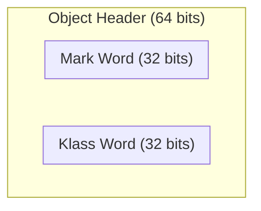
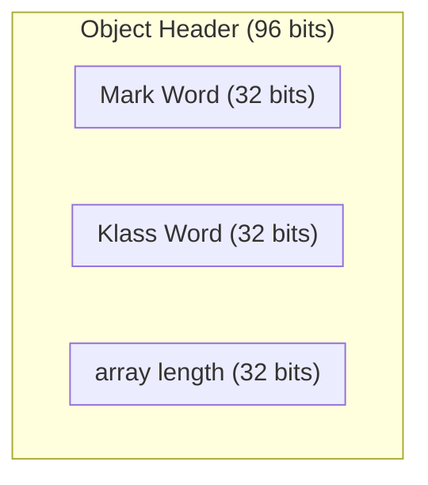

# 管程
## 1.管程问题
共享带来的问题<br>
### Java的体现
两个线程对初始值0的静态变量一个做自增, 一个做自减, 各做5000次, 结果是0吗?
```java
static int counter = 0;

public static void main(String[] args) {
    Thread t1 = new Thread(()-> {
        for(int i = 0; i<5000; ++i) {
            counter++;
        }
    }, "t1");

    Thread t2 = new Thread(()-> {
        for(int i = 0; i<5000; ++i) {
            counter--;
        }
    }, "t2");

    t1.start();
    t2.start();
    t1.join();
    t2.join();
    log.debug("{}", counter);
}
```

### 问题分析
以上的结果可能是正数, 负数, 零, 为什么?<br>
因为Java中对静态变量的自增, 自减并不是原子操作, 要彻底理解, 必须从字节码来进行分析

例如对于i++而言(i为静态变量), 实际会产生如下的字节码指令:
```class
getstatic   i //获取静态变量i的值
iconst_1      //准备常量i
iadd          //自增
putstatic   i //将修改后的值存入静态变量i
```
而对应的i--也是类似:
```class
getstatic   i //获取静态变量i的值
iconst_1      //准备常量i
isub          //自减
putstatic   i //将修改后的值存入静态变量i
```
而Java的内存模型如下, 完成静态变量的自增, 自减需要在主存和工作内存中进行数据交换:


### 临界区(Critical Section)
- 一个程序运行多个线程本身没有问题
- 问题出现在多个线程访问共享资源
  1. 多个线程读取共享资源也没有问题
  2. 在多个线程对共享资源读写操作时发生指令交错, 就会出现问题
- 一段代码块内如果存在对共享资源的多线程读写操作, 称这段代码块为临界区
  
例如, 下面代码中的临界区
```java
static int counter = 0;

static void increment() 
// 临界区
{
    counter++;
}

static void decrement()
// 临界区
{
    counter--;
}
```

### 竞态条件(Race Condition)
多个线程在临界区内执行, 由于代码的执行序列不同而导致结果无法预测, 称之为发生了竞态条件

## 2.synchronized
### 应用之互斥
为了避免临界区的竞态条件发生, 有多种手段可以达到目的
- 阻塞式的解决方案: synchronized, Lock
- 非阻塞式的解决方案: 原子变量
  
本次课使用阻塞式的解决方案:synchronized来解决问题, 即俗称的<b>对象锁</b>, 它采用互斥的方式让同一时刻至多只有一个线程能持有对象锁, 其他线程再想获取这个对象锁时就会阻塞住. 这样就能保证拥有锁的线程能够安全的执行临界区内的代码, 不用担心线程上下文切换

虽然java中互斥和同步都可以采用synchronized关键字来完成, 但它们还是有区别的:
- 互斥是保证临界区的竞态条件发生, 同一时刻只能有一个线程执行临界区代码
- 同步是由于线程执行的先后, 顺序不同, 需要一个线程等待其他线程运行到某个点

## 3.线程安全分析
[转账分析](https://www.bilibili.com/video/BV16J411h7Rd?spm_id_from=333.788.videopod.episodes&vd_source=87f168d5f6bd2eb6e55e81b9f6e63e79&p=74)

## 4.Monitor
### Java对象头
以32位虚拟机为例
#### 普通对象


#### 数组对象

#### Mark Word


#### 原理之Monitor(锁)
Monitor被翻译成<b>监视器</b>或<b>管程</b>
每个Java对象都可以关联一个Monitor对象, 如果使用synchronized给对象上锁(重量级)之后, 该对象头的Mark Word中就被设置指向Monitor对象的指针
Monitor结构如下

- 刚开始Monitor中Owner为null
- 当Thread2执行synchronized(obj)就会将Monitor的所有者Owner设置为Thread2, Monitor中只能有一个Owner
- 在Thread2执行过程中, 如果Thread3, Thread4...也来执行synchronized(obj), 就会进入到EntryList BLOCKED
- Thread2执行完同步代码块中的内容后, 会唤醒EntryList中等待的线程来竞争锁, 竞争的时候是非公平的
- 图中WaitSet中的Thread0, Thread1是之前获得过锁, 但条件不满足进入WAITING状态的线程
  
注意:
- synchronized必须是进入同一个对象的Monitor才有上述效果
- 不加synchronized的对象不会关联监视器, 不遵从上述规则

#### 原理之synchronized
```java
public class Solution {
    static final Object lock = new Object();
    static int counter = 0;

    public static void main(String[] args) {
        synchronized (lock) {
            counter++;
        }
    }
}
```

对应的字节码为
```class
public static void main(java.lang.String[]);
    Code:
       0: getstatic     #7                  // Field lock:Ljava/lang/Object;
       3: dup
       4: astore_1
       5: monitorenter
       6: getstatic     #13                 // Field counter:I
       9: iconst_1
      10: iadd
      11: putstatic     #13                 // Field counter:I
      14: aload_1
      15: monitorexit
      16: goto          24
      19: astore_2
      20: aload_1
      21: monitorexit
      22: aload_2
      23: athrow
      24: return
    Exception table:
       from    to  target type
           6    16    19   any
          19    22    19   any
```
#### synchronized原理进阶
##### 1.轻量级锁
轻量级锁的场景: 如果一个对象虽然有多线程访问, 但多线程访问的时间是错开的(也就是没有竞争), 那么可以使用轻量级锁来优化

轻量级锁对使用者是透明的, 即语法仍然是synchronized

假设有两个方法同步块, 利用同一个对象加锁
```java
static final Object obj = new Object();
public static void method1() {
    synchronized(obj) {
        // 同步块A
        method2();
    }
}
public static void method2() {
    synchronized(obj) {
        // 同步块B
    }
}
```
- 创建锁记录(Lock Record)对象, 每个线程的栈帧都会包含一个锁记录的结构, 内部可以存储锁定对象的Mark Word
  
- 让锁记录中Object reference指向锁对象, 并尝试用cas替换Object的Mark Word, 将Mark Word的值存入锁记录
  
- 如果cas替换成功, 对象头中存储了锁记录地址和状态00, 表示由该线程给对象加锁, 这时图示如下
  
- 如果cas失败, 有两种情况:
  - 如果是其他线程已经持有了该Object的轻量级锁, 这时表明有竞争, 进入锁膨胀过程
  - 如果是自己执行了synchronized锁重入, 那么再添加一条Lock Record作为重入的计数
  
- 当退出synchronized代码块(解锁时)如果有取值为null的锁记录, 表示有重入, 这时重置锁记录, 表示重入计数减1
   
- 当退出synchronized代码块(解锁时)锁记录的值不为null, 这时使用cas将Mark Word的值恢复给对象头
  - 成功, 则解锁成功
  - 失败, 说明轻量级锁进行了锁膨胀或已经升级为重量级锁, 进入重量级锁解锁流程

##### 2.锁膨胀
如果在尝试加轻量级锁的过程中, CAS操作无法成功, 这时一种情况就是有其他线程为此对象加上了轻量级锁(有竞争), 这时需要进行锁膨胀, 将轻量级锁变为重量级锁
```java
static Object obj = new Object();
public static void method1() {
    synchronized(obj) {
        // 同步块
    }
}
```
- 当Thread-1进行轻量级加锁时, Thread-0已经对该对象加了轻量级锁
  
- 这时Thread-1加轻量级锁失败, 进入锁膨胀流程
  - 即为Object对象申请Monitor锁, 让Object指向重量级锁地址
  - 然后自己进入Monitor的EntryList BLOCKED 
  
- 当Thread-0退出同步块解锁时, 使用cas将Mark Word的值恢复给对象头, 失败. 这时会进入重量级解锁流程, 即按照Monitor地址找到Monitor对象, 设置Owner为null, 唤醒EntryList中BLOCKED线程

##### 3.自旋优化
重量级锁竞争的时候, 还可以使用自旋来进行优化, 如果当前线程自旋成功(即这时候持锁线程已经退出了同步块, 释放了锁), 这时当前线程就可以避免阻塞.

自旋重试成功的情况
|线程1(CPU1上)|对象Mark|线程2(CPU2上)|
|--|--|--|
|-|10(重量锁)|-|
|访问同步块,获取Monitor|10(重量锁) 重量锁指针|-|
|成功(加锁)|10(重量锁) 重量锁指针|-|
|执行同步块|10(重量锁) 重量锁指针|-|
|执行同步块|10(重量锁) 重量锁指针|访问同步块, 获取Monitor|
|执行同步块|10(重量锁) 重量锁指针|自旋重试|
|执行完毕|10(重量锁) 重量锁指针|自旋重试|
|成功(解锁)|01(无锁)|自旋重试|
|-|10(重量锁) 重量锁指针|成功(加锁)|
|-|10(重量锁) 重量锁指针|执行同步块|
|-|..|..|

自旋重试失败的情况
|线程1(CPU1上)|对象Mark|线程2(CPU2上)|
|--|--|--|
|-|10(重量锁)|-|
|访问同步块,获取Monitor|10(重量锁) 重量锁指针|-|
|成功(加锁)|10(重量锁) 重量锁指针|-|
|执行同步块|10(重量锁) 重量锁指针|-|
|执行同步块|10(重量锁) 重量锁指针|访问同步块, 获取Monitor|
|执行同步块|10(重量锁) 重量锁指针|自旋重试|
|执行同步块|10(重量锁) 重量锁指针|自旋重试|
|执行同步块|10(重量锁) 重量锁指针|自旋重试|
|执行同步块|10(重量锁) 重量锁指针|阻塞|
|..|..|..|

- 在java6以后自旋锁是自适应的, 比如对象刚刚一次自旋操作成功过, 那么就认为这次自旋成功的可能性会高, 就多自旋几次; 反之, 就少自旋甚至不自旋, 总之, 比较智能;
- 自旋会占用CPU时间, 单核CPU自旋就是浪费, 多核CPU自旋才能发挥优势
- java7之后不能控制是否开启自旋功能

##### 4.偏向锁
轻量级锁在没有竞争时(就自己这个线程), 每次重入仍然需要执行CAS操作

java6引入偏向锁来做进一步优化: 只有第一次使用CAS将线程ID设置到对象的Mark Word头, 之后发现这个线程ID是自己的就表示没有竞争, 不用重新CAS. 以后只要不发生竞争, 这个对象就归该线程所有

例如:
```java
static final Object obj = new Object();
public static void m1() {
    synchronized(obj) {
        // 同步块A
        m2();
    }
}
public static void m2() {
    synchronized(obj) {
        // 同步块B
        m3();
    }
}
public static void m3() {
    synchronized(obj) {
        // 同步块C
    }
}
```


###### 4.1偏向状态
回忆一下对象头格式

一个对象创建时:
- 如果开启了偏向锁(默认开启), 那么对象创建后, markword值为0x05即最后3位为101, 这时它的Thread, epoch, age都为0
- 偏向锁是默认延迟的, 不会在程序启动时立即生效, 如果想避免延迟, 可以加VM参数 -XX:BiasedLockingStartupDelay=0来禁用延迟
- 如果没有开启偏向锁, 那么对象创建后, markword值为0x01即最后3位为001, 这时它的hashcode, age都为0, 第一次用到hashcode时才会赋值

###### 4.2撤销-其他线程使用对象
###### 4.3撤销-调用对象hashcode
###### 4.4撤销-调用wait/notify
###### 4.5批量重偏向
###### 4.6批量撤销

##### 5.锁消除
JIT 即时编译会进一步优化代码

## 5.wait/notify
### wait/notify的原理

- Owner线程发现条件不满足, 调用wait方法,即可进入WaitSet变为WAITING状态
- BLOCKED和WAITING的线程都处于阻塞状态, 不占用CPU时间片
- BLOCKED线程会在Owner线程释放锁时唤醒
- WAITING线程会在Owner线程调用notify或notifyAll时唤醒, 但唤醒后并不意味着立刻获得锁, 仍需进入EntryList重新竞争 

### API介绍
- obj.wait()
  - 让进入Object监视器的线程到waitSet等待(一直等待)
- obj.wait(long)
  - 让进入Object监视器的线程到waitSet等待(等待给定时间)
- obj.notify()
  - 在Object上正在waitSet等待的线程中挑一个唤醒
- obj.notifyAll()
  - 让Object上正在waitSet等待的线程全部唤醒

它们都是线程之间进行协作的手段, 都属于Object对象的方法, <font color=red>必须或得此对象的锁, 才能调用这几个方法</font>

```java
@Slf4j(topic = "test")
public class Test {
    static final Object lock = new Object();

    public static void main(String[] args) throws InterruptedException {
        // 必须是进入了synchronized代码块才能用wait方法
        synchronized (lock) {
            lock.wait();
        }
    }
}
```

### 使用注意
#### sleep(long)和wait(long)的区别
- sleep是Thread的方法, 而wait是Object的方法
- sleep不需要强制和synchronized配合使用, 但wait需要和synchronized一起用
- sleep在睡眠的同时, 不会释放对象锁, 但wait在等待的时候会释放对象锁
- 它们的状态都是TIMED_WAITING

以下这段代码有什么缺点?
```java
@Slf4j(topic = "TestCorrectPostureStep")
public class TestCorrectPostureStep1 {
    static final Object room = new Object();
    static boolean hasCigarette = false;
    static boolean hasTakeout = false;

    public static void main(String[] args) throws InterruptedException {
        new Thread(()->{
            synchronized (room) {
                log.debug("有烟没?[{}]", hasCigarette);
                if(!hasCigarette) {
                    log.debug("没有烟, 先歇会");
                    try {
                        Thread.sleep(2);
                    } catch (InterruptedException e) {
                        throw new RuntimeException(e);
                    }
                }
                log.debug("有烟没?[{}]", hasCigarette);
                if(hasCigarette) {
                    log.debug("可以开始干活");
                }
            }
        }, "小南").start();

        for(int i = 0; i<5; ++i) {
            new Thread(() -> {
                synchronized (room) {
                    log.debug("可以开始干活了");
                }
            }, "其他人").start();
        }

        Thread.sleep(1);
        new Thread(()-> {
            hasCigarette = true;
            log.debug("烟到了哦!");
        }, "送烟的").start();
    }
}
```
其他干活的线程, 都要一直阻塞, 效率太低<br>
小南线程必须睡足2s后才能醒来, 就算烟提前送到, 也无法立刻醒来<br>
加了synchronized(room)后, 就好比小南在里面反锁了门睡觉, 烟根本没法送进门, main没加synchronized就好像main线程是翻窗户进来的<br>
解决办法: 使用wait-notify机制

```java
@Slf4j(topic = "TestCorrectPostureStep")
public class TestCorrectPostureStep1 {
    static final Object room = new Object();
    static boolean hasCigarette = false;
    static boolean hasTakeout = false;

    public static void main(String[] args) throws InterruptedException {
        new Thread(() -> {
            synchronized (room) {
                log.debug("有烟没?[{}]", hasCigarette);
                while (!hasCigarette) {
                    log.debug("没有烟, 先歇会");
                    try {
                        room.wait();
                    } catch (InterruptedException e) {
                        throw new RuntimeException(e);
                    }
                }
                log.debug("有烟没?[{}]", hasCigarette);
                if (hasCigarette) {
                    log.debug("可以开始干活");
                }
            }
        }, "小南").start();

        for (int i = 0; i < 5; ++i) {
            new Thread(() -> {
                synchronized (room) {
                    log.debug("可以开始干活了");
                }
            }, "其他人").start();
        }

        Thread.sleep(1);
        new Thread(() -> {
            synchronized (room) {
                hasCigarette = true;
                log.debug("烟到了哦!");
                room.notifyAll();
            }
        }, "送烟的").start();
    }
}
```


## 6.线程状态转换
## 7.活跃性
## 8.Lock