# 管程
## 1.管程问题
共享带来的问题<br>
### Java的体现
两个线程对初始值0的静态变量一个做自增, 一个做自减, 各做5000次, 结果是0吗?
```java
static int counter = 0;

public static void main(String[] args) {
    Thread t1 = new Thread(()-> {
        for(int i = 0; i<5000; ++i) {
            counter++;
        }
    }, "t1");

    Thread t2 = new Thread(()-> {
        for(int i = 0; i<5000; ++i) {
            counter--;
        }
    }, "t2");

    t1.start();
    t2.start();
    t1.join();
    t2.join();
    log.debug("{}", counter);
}
```

### 问题分析
以上的结果可能是正数, 负数, 零, 为什么?<br>
因为Java中对静态变量的自增, 自减并不是原子操作, 要彻底理解, 必须从字节码来进行分析

例如对于i++而言(i为静态变量), 实际会产生如下的字节码指令:
```class
getstatic   i //获取静态变量i的值
iconst_1      //准备常量i
iadd          //自增
putstatic   i //将修改后的值存入静态变量i
```
而对应的i--也是类似:
```class
getstatic   i //获取静态变量i的值
iconst_1      //准备常量i
isub          //自减
putstatic   i //将修改后的值存入静态变量i
```
而Java的内存模型如下, 完成静态变量的自增, 自减需要在主存和工作内存中进行数据交换:
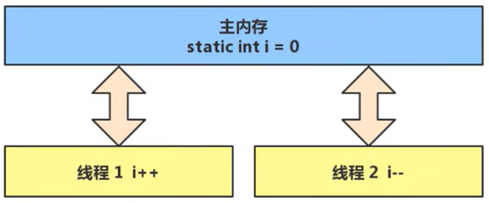

### 临界区(Critical Section)
- 一个程序运行多个线程本身没有问题
- 问题出现在多个线程访问共享资源
  1. 多个线程读取共享资源也没有问题
  2. 在多个线程对共享资源读写操作时发生指令交错, 就会出现问题
- 一段代码块内如果存在对共享资源的多线程读写操作, 称这段代码块为临界区
  
例如, 下面代码中的临界区
```java
static int counter = 0;

static void increment() 
// 临界区
{
    counter++;
}

static void decrement()
// 临界区
{
    counter--;
}
```

### 竞态条件(Race Condition)
多个线程在临界区内执行, 由于代码的执行序列不同而导致结果无法预测, 称之为发生了竞态条件

## 2.synchronized
### 应用之互斥
为了避免临界区的竞态条件发生, 有多种手段可以达到目的
- 阻塞式的解决方案: synchronized, Lock
- 非阻塞式的解决方案: 原子变量
  
本次课使用阻塞式的解决方案:synchronized来解决问题, 即俗称的<b>对象锁</b>, 它采用互斥的方式让同一时刻至多只有一个线程能持有对象锁, 其他线程再想获取这个对象锁时就会阻塞住. 这样就能保证拥有锁的线程能够安全的执行临界区内的代码, 不用担心线程上下文切换

虽然java中互斥和同步都可以采用synchronized关键字来完成, 但它们还是有区别的:
- 互斥是保证临界区的竞态条件发生, 同一时刻只能有一个线程执行临界区代码
- 同步是由于线程执行的先后, 顺序不同, 需要一个线程等待其他线程运行到某个点

## 3.线程安全分析
[转账分析](https://www.bilibili.com/video/BV16J411h7Rd?spm_id_from=333.788.videopod.episodes&vd_source=87f168d5f6bd2eb6e55e81b9f6e63e79&p=74)

## 4.Monitor
### Java对象头
以32位虚拟机为例
#### 普通对象
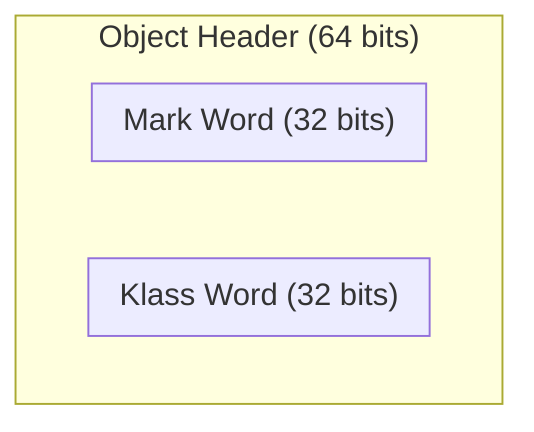

#### 数组对象
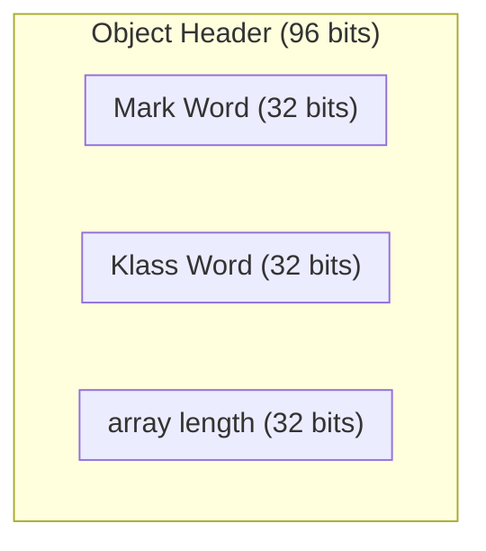
#### Mark Word
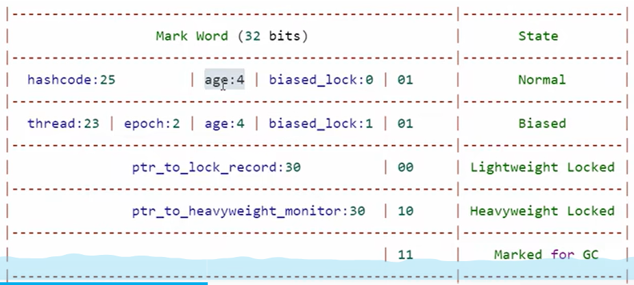

#### 原理之Monitor(锁)
Monitor被翻译成<b>监视器</b>或<b>管程</b>
每个Java对象都可以关联一个Monitor对象, 如果使用synchronized给对象上锁(重量级)之后, 该对象头的Mark Word中就被设置指向Monitor对象的指针
Monitor结构如下
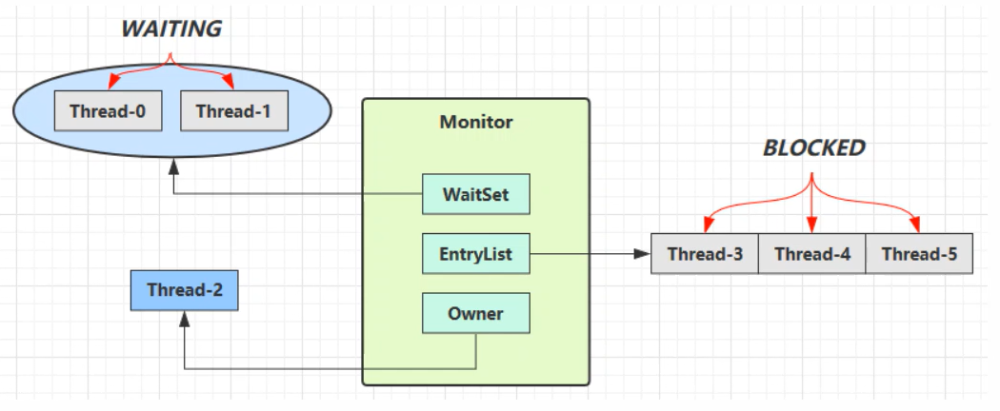
- 刚开始Monitor中Owner为null
- 当Thread2执行synchronized(obj)就会将Monitor的所有者Owner设置为Thread2, Monitor中只能有一个Owner
- 在Thread2执行过程中, 如果Thread3, Thread4...也来执行synchronized(obj), 就会进入到EntryList BLOCKED
- Thread2执行完同步代码块中的内容后, 会唤醒EntryList中等待的线程来竞争锁, 竞争的时候是非公平的
- 图中WaitSet中的Thread0, Thread1是之前获得过锁, 但条件不满足进入WAITING状态的线程
  
注意:
- synchronized必须是进入同一个对象的Monitor才有上述效果
- 不加synchronized的对象不会关联监视器, 不遵从上述规则

#### 原理之synchronized
```java
public class Solution {
    static final Object lock = new Object();
    static int counter = 0;

    public static void main(String[] args) {
        synchronized (lock) {
            counter++;
        }
    }
}
```

对应的字节码为
```class
public static void main(java.lang.String[]);
    Code:
       0: getstatic     #7                  // Field lock:Ljava/lang/Object;
       3: dup
       4: astore_1
       5: monitorenter
       6: getstatic     #13                 // Field counter:I
       9: iconst_1
      10: iadd
      11: putstatic     #13                 // Field counter:I
      14: aload_1
      15: monitorexit
      16: goto          24
      19: astore_2
      20: aload_1
      21: monitorexit
      22: aload_2
      23: athrow
      24: return
    Exception table:
       from    to  target type
           6    16    19   any
          19    22    19   any
```
#### synchronized原理进阶
##### 1.轻量级锁
轻量级锁的场景: 如果一个对象虽然有多线程访问, 但多线程访问的时间是错开的(也就是没有竞争), 那么可以使用轻量级锁来优化

轻量级锁对使用者是透明的, 即语法仍然是synchronized

假设有两个方法同步块, 利用同一个对象加锁
```java
static final Object obj = new Object();
public static void method1() {
    synchronized(obj) {
        // 同步块A
        method2();
    }
}
public static void method2() {
    synchronized(obj) {
        // 同步块B
    }
}
```
- 创建锁记录(Lock Record)对象, 每个线程的栈帧都会包含一个锁记录的结构, 内部可以存储锁定对象的Mark Word
  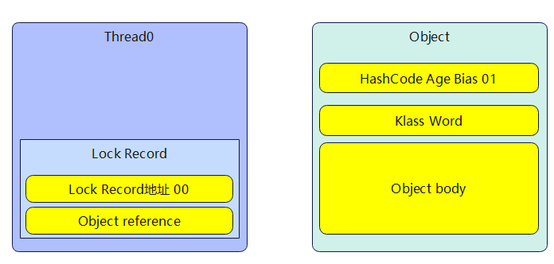
- 让锁记录中Object reference指向锁对象, 并尝试用cas替换Object的Mark Word, 将Mark Word的值存入锁记录
  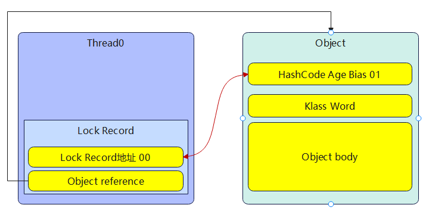
- 如果cas替换成功, 对象头中存储了锁记录地址和状态00, 表示由该线程给对象加锁, 这时图示如下
  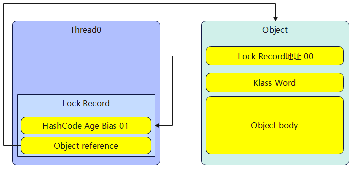
- 如果cas失败, 有两种情况:
  - 如果是其他线程已经持有了该Object的轻量级锁, 这时表明有竞争, 进入锁膨胀过程
  - 如果是自己执行了synchronized锁重入, 那么再添加一条Lock Record作为重入的计数
  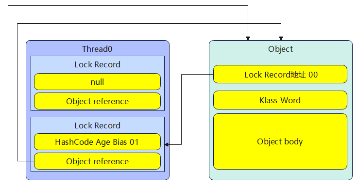
- 当退出synchronized代码块(解锁时)如果有取值为null的锁记录, 表示有重入, 这时重置锁记录, 表示重入计数减1
  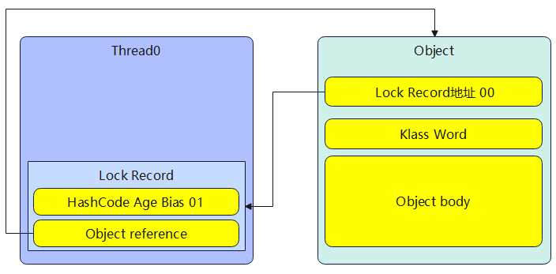 
- 当退出synchronized代码块(解锁时)锁记录的值不为null, 这时使用cas将Mark Word的值恢复给对象头
  - 成功, 则解锁成功
  - 失败, 说明轻量级锁进行了锁膨胀或已经升级为重量级锁, 进入重量级锁解锁流程

##### 2.锁膨胀
如果在尝试加轻量级锁的过程中, CAS操作无法成功, 这时一种情况就是有其他线程为此对象加上了轻量级锁(有竞争), 这时需要进行锁膨胀, 将轻量级锁变为重量级锁
```java
static Object obj = new Object();
public static void method1() {
    synchronized(obj) {
        // 同步块
    }
}
```
- 当Thread-1进行轻量级加锁时, Thread-0已经对该对象加了轻量级锁
  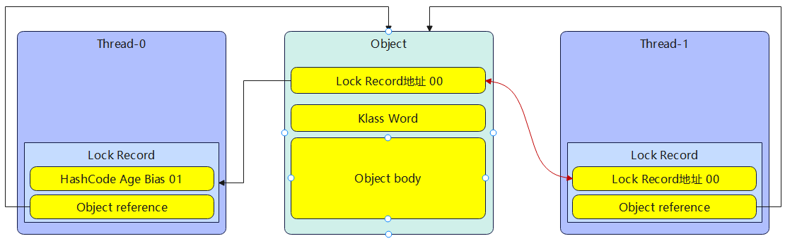
- 这时Thread-1加轻量级锁失败, 进入锁膨胀流程
  - 即为Object对象申请Monitor锁, 让Object指向重量级锁地址
  - 然后自己进入Monitor的EntryList BLOCKED 
  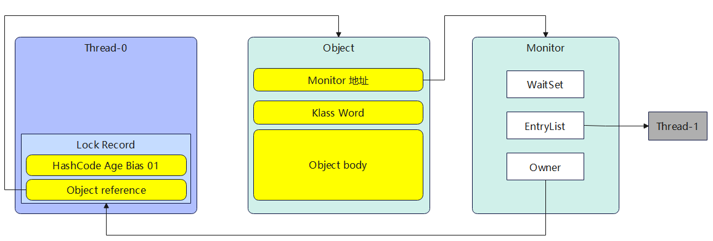
- 当Thread-0退出同步块解锁时, 使用cas将Mark Word的值恢复给对象头, 失败. 这时会进入重量级解锁流程, 即按照Monitor地址找到Monitor对象, 设置Owner为null, 唤醒EntryList中BLOCKED线程

##### 3.自旋优化
重量级锁竞争的时候, 还可以使用自旋来进行优化, 如果当前线程自旋成功(即这时候持锁线程已经退出了同步块, 释放了锁), 这时当前线程就可以避免阻塞.

自旋重试成功的情况
|线程1(CPU1上)|对象Mark|线程2(CPU2上)|
|--|--|--|
|-|10(重量锁)|-|
|访问同步块,获取Monitor|10(重量锁) 重量锁指针|-|
|成功(加锁)|10(重量锁) 重量锁指针|-|
|执行同步块|10(重量锁) 重量锁指针|-|
|执行同步块|10(重量锁) 重量锁指针|访问同步块, 获取Monitor|
|执行同步块|10(重量锁) 重量锁指针|自旋重试|
|执行完毕|10(重量锁) 重量锁指针|自旋重试|
|成功(解锁)|01(无锁)|自旋重试|
|-|10(重量锁) 重量锁指针|成功(加锁)|
|-|10(重量锁) 重量锁指针|执行同步块|
|-|..|..|

自旋重试失败的情况
|线程1(CPU1上)|对象Mark|线程2(CPU2上)|
|--|--|--|
|-|10(重量锁)|-|
|访问同步块,获取Monitor|10(重量锁) 重量锁指针|-|
|成功(加锁)|10(重量锁) 重量锁指针|-|
|执行同步块|10(重量锁) 重量锁指针|-|
|执行同步块|10(重量锁) 重量锁指针|访问同步块, 获取Monitor|
|执行同步块|10(重量锁) 重量锁指针|自旋重试|
|执行同步块|10(重量锁) 重量锁指针|自旋重试|
|执行同步块|10(重量锁) 重量锁指针|自旋重试|
|执行同步块|10(重量锁) 重量锁指针|阻塞|
|..|..|..|

- 在java6以后自旋锁是自适应的, 比如对象刚刚一次自旋操作成功过, 那么就认为这次自旋成功的可能性会高, 就多自旋几次; 反之, 就少自旋甚至不自旋, 总之, 比较智能;
- 自旋会占用CPU时间, 单核CPU自旋就是浪费, 多核CPU自旋才能发挥优势
- java7之后不能控制是否开启自旋功能

##### 4.偏向锁
轻量级锁在没有竞争时(就自己这个线程), 每次重入仍然需要执行CAS操作

java6引入偏向锁来做进一步优化: 只有第一次使用CAS将线程ID设置到对象的Mark Word头, 之后发现这个线程ID是自己的就表示没有竞争, 不用重新CAS. 以后只要不发生竞争, 这个对象就归该线程所有

例如:
```java
static final Object obj = new Object();
public static void m1() {
    synchronized(obj) {
        // 同步块A
        m2();
    }
}
public static void m2() {
    synchronized(obj) {
        // 同步块B
        m3();
    }
}
public static void m3() {
    synchronized(obj) {
        // 同步块C
    }
}
```
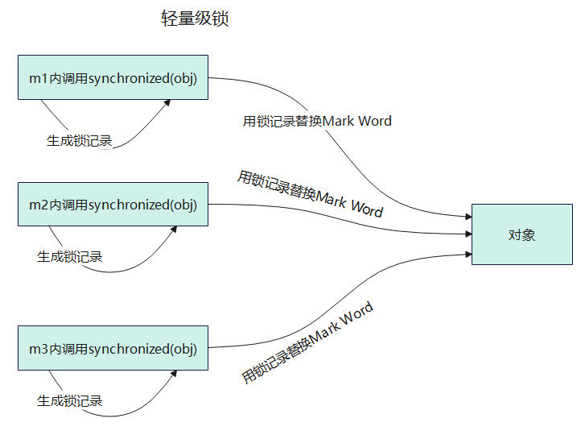
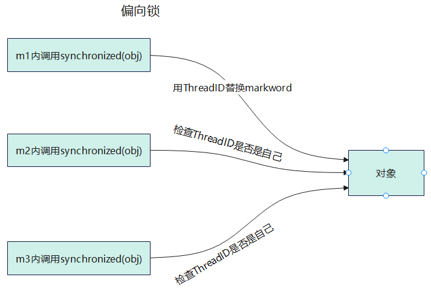

###### 4.1偏向状态
回忆一下对象头格式
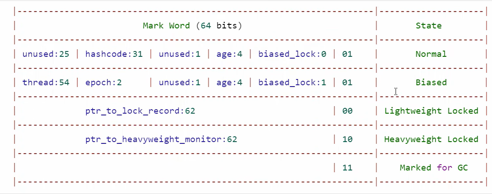
一个对象创建时:
- 如果开启了偏向锁(默认开启), 那么对象创建后, markword值为0x05即最后3位为101, 这时它的Thread, epoch, age都为0
- 偏向锁是默认延迟的, 不会在程序启动时立即生效, 如果想避免延迟, 可以加VM参数 -XX:BiasedLockingStartupDelay=0来禁用延迟
- 如果没有开启偏向锁, 那么对象创建后, markword值为0x01即最后3位为001, 这时它的hashcode, age都为0, 第一次用到hashcode时才会赋值

###### 4.2撤销-其他线程使用对象
###### 4.3撤销-调用对象hashcode
###### 4.4撤销-调用wait/notify
###### 4.5批量重偏向
###### 4.6批量撤销

##### 5.锁消除
JIT 即时编译会进一步优化代码

## 5.wait/notify
### wait/notify的原理
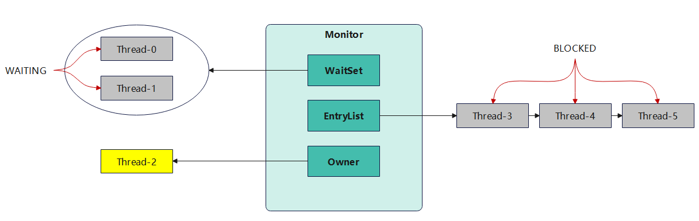
- Owner线程发现条件不满足, 调用wait方法,即可进入WaitSet变为WAITING状态
- BLOCKED和WAITING的线程都处于阻塞状态, 不占用CPU时间片
- BLOCKED线程会在Owner线程释放锁时唤醒
- WAITING线程会在Owner线程调用notify或notifyAll时唤醒, 但唤醒后并不意味着立刻获得锁, 仍需进入EntryList重新竞争 

### API介绍
- obj.wait()
  - 让进入Object监视器的线程到waitSet等待(一直等待)
- obj.wait(long)
  - 让进入Object监视器的线程到waitSet等待(等待给定时间)
- obj.notify()
  - 在Object上正在waitSet等待的线程中挑一个唤醒
- obj.notifyAll()
  - 让Object上正在waitSet等待的线程全部唤醒

它们都是线程之间进行协作的手段, 都属于Object对象的方法, <font color=red>必须或得此对象的锁, 才能调用这几个方法</font>

```java
@Slf4j(topic = "test")
public class Test {
    static final Object lock = new Object();

    public static void main(String[] args) throws InterruptedException {
        // 必须是进入了synchronized代码块才能用wait方法
        synchronized (lock) {
            lock.wait();
        }
    }
}
```

### 使用注意
#### sleep(long)和wait(long)的区别
- sleep是Thread的方法, 而wait是Object的方法
- sleep不需要强制和synchronized配合使用, 但wait需要和synchronized一起用
- sleep在睡眠的同时, 不会释放对象锁, 但wait在等待的时候会释放对象锁
- 它们的状态都是TIMED_WAITING

以下这段代码有什么缺点?
```java
@Slf4j(topic = "TestCorrectPostureStep")
public class TestCorrectPostureStep1 {
    static final Object room = new Object();
    static boolean hasCigarette = false;
    static boolean hasTakeout = false;

    public static void main(String[] args) throws InterruptedException {
        new Thread(()->{
            synchronized (room) {
                log.debug("有烟没?[{}]", hasCigarette);
                if(!hasCigarette) {
                    log.debug("没有烟, 先歇会");
                    try {
                        Thread.sleep(2);
                    } catch (InterruptedException e) {
                        throw new RuntimeException(e);
                    }
                }
                log.debug("有烟没?[{}]", hasCigarette);
                if(hasCigarette) {
                    log.debug("可以开始干活");
                }
            }
        }, "小南").start();

        for(int i = 0; i<5; ++i) {
            new Thread(() -> {
                synchronized (room) {
                    log.debug("可以开始干活了");
                }
            }, "其他人").start();
        }

        Thread.sleep(1);
        new Thread(()-> {
            hasCigarette = true;
            log.debug("烟到了哦!");
        }, "送烟的").start();
    }
}
```
其他干活的线程, 都要一直阻塞, 效率太低<br>
小南线程必须睡足2s后才能醒来, 就算烟提前送到, 也无法立刻醒来<br>
加了synchronized(room)后, 就好比小南在里面反锁了门睡觉, 烟根本没法送进门, main没加synchronized就好像main线程是翻窗户进来的<br>
解决办法: 使用wait-notify机制

```java
@Slf4j(topic = "TestCorrectPostureStep")
public class TestCorrectPostureStep1 {
    static final Object room = new Object();
    static boolean hasCigarette = false;
    static boolean hasTakeout = false;

    public static void main(String[] args) throws InterruptedException {
        new Thread(() -> {
            synchronized (room) {
                log.debug("有烟没?[{}]", hasCigarette);
                while (!hasCigarette) {
                    log.debug("没有烟, 先歇会");
                    try {
                        room.wait();
                    } catch (InterruptedException e) {
                        throw new RuntimeException(e);
                    }
                }
                log.debug("有烟没?[{}]", hasCigarette);
                if (hasCigarette) {
                    log.debug("可以开始干活");
                }
            }
        }, "小南").start();

        for (int i = 0; i < 5; ++i) {
            new Thread(() -> {
                synchronized (room) {
                    log.debug("可以开始干活了");
                }
            }, "其他人").start();
        }

        Thread.sleep(1);
        new Thread(() -> {
            synchronized (room) {
                hasCigarette = true;
                log.debug("烟到了哦!");
                room.notifyAll();
            }
        }, "送烟的").start();
    }
}
```


## 6.park/unpark
### 基本使用
它们是LockSupport类中的方法
```java
// 暂停当前线程
LockSupport.park();

// 恢复某个线程的运行
LockSupport.unpark(暂停线程对象);
```
先park再unpark
```java
@Slf4j(topic = "TestLockSupport")
public class TestLockSupport {
    public static void main(String[] args) {
        Thread t1 = new Thread(() -> {
            log.info("start....");
            sleep(1000);
            log.info("park...");
            LockSupport.park();
            log.info("resume...");
        }, "t1");
        t1.start();

        sleep(2000);
        log.info("unpark...");
        LockSupport.unpark(t1);
    }

    private static void sleep(int millis) {
        try {
            Thread.sleep(millis);
        } catch (InterruptedException e) {
            throw new RuntimeException(e);
        }
    }
}
```

### park/unpark与wait/notifyAll的区别
与Object的wait/notifyAll比
- wait,notify和notifyAll必须配合Object Monitor一起使用, 而park & unpark不必
- park & unpark是以线程为单位来<font color=pink>阻塞</font>和<font color=pink>唤醒</font>线程, 而notify只能随机唤醒一个等待线程, notifyAll是唤醒所有等待线程, 不那么<font color=pink>精确</font>
- park & unpark可以先unpark, 而wait & notify不能先notify

### 底层实现原理
每个线程都有自己一个Parker对象, 由3部分组成_counter, _cond, _mutex
- 线程就像一个旅人, Parker就像他随身携带的背包, 条件变量就好比背包中的帐篷. _counter就好比背包中的备用干粮(0为耗尽, 1为充足)
- 调用park就是要看需不需要停下来歇息
    - 如果备用干粮耗尽, 那么钻进帐篷休息
    - 如果备用干粮充足, 那么不需要停留, 继续前进
- 调用unpark, 就好比令干粮充足
    - 如果这时线程还在帐篷, 就唤醒让他继续前进
    - 如果这时线程还在运行, 那么下次他调用park时, 仅是消耗掉备用干粮, 不需要停留, 继续前进
        - 因为背包空间有限, 多次调用unpark仅会补充一份备用干粮

调用park的流程
1. 当前线程调用Unsafe.park()方法
2. 检查_counter, 本情况为0, 这时, 或得_mutex互斥锁
3. 线程进入_cond条件变量阻塞
4. 设置_counter=0

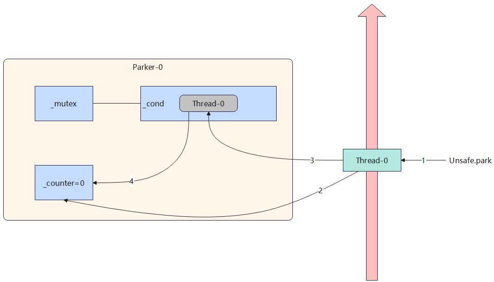

调用unpark的流程
1. 调用Unsafe.unpark(Thread-0)方法, 设置_counter为1
2. 唤醒_cond条件变量中的Thread-0
3. Thread-0恢复运行
4. 设置_counter为0

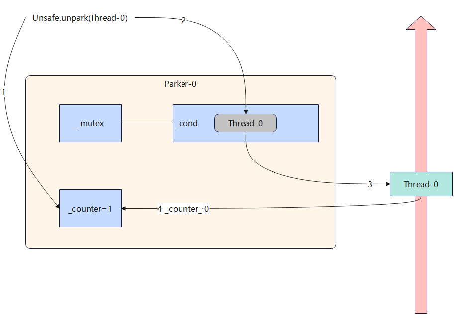

先调用unpark再调用park的流程
1. 调用Unsafe.unpark(Thread-0)方法, 设置_counter为1
2. 当前线程调用Unsafe.park()方法
3. 检查_counter, 本情况为1, 这时线程无需阻塞, 继续运行
4. 设置_counter为0

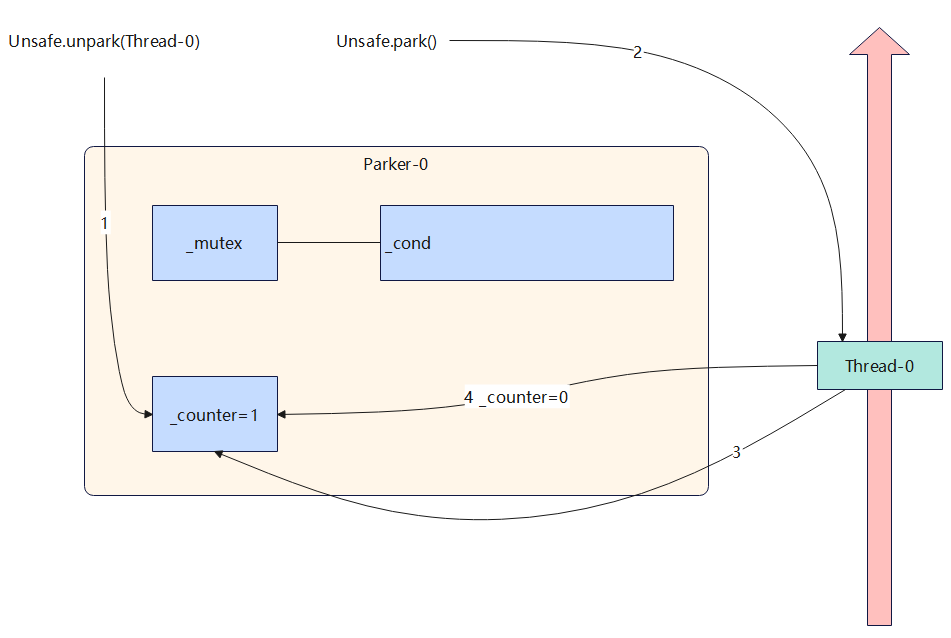

## 7.<font color=red>线程状态转换*</font>
假设有线程Thread t
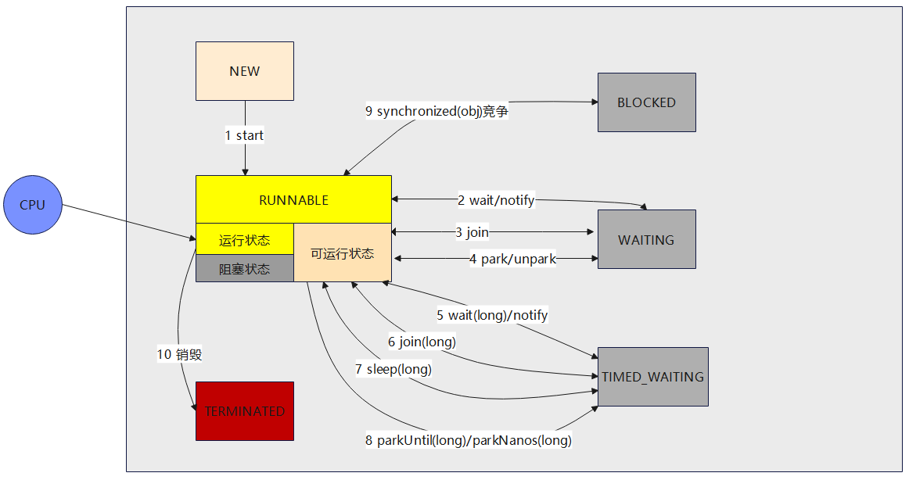
### 情况1 NEW --> RUNNABLE
当调用t.start()方法时, 由NEW --> RUNNABLE
### 情况2 RUNNABLE <--> WAITING
t线程用 synchronized(obj)获取了对象锁后
- 调用obj.wait()方法时, t线程从RUNNABLE --> WAITING
- 调用obj.notify(), obj.notifyAll, t.interrupt()时
    - 竞争锁成功, t线程从WAITING --> RUNNABLE
    - 竞争锁失败, t线程从WAITING --> BLOCKED
```java
@Slf4j(topic = "TestWaitNotify")
public class TestWaitNotify {
    final static Object obj = new Object();

    public static void main(String[] args) {
        new Thread(() -> {
            synchronized (obj) {
                log.info("执行");
                try {
                    obj.wait();
                } catch (InterruptedException e) {
                    throw new RuntimeException(e);
                }
                log.info("执行其他代码..");
            }
        }, "t1").start();

        new Thread(() -> {
            synchronized (obj) {
                try {
                    obj.wait();
                } catch (InterruptedException e) {
                    throw new RuntimeException(e);
                }
                log.info("执行其他代码...");
            }
        }, "t2").start();

        sleep();
        log.info("唤醒 obj 上其他线程");
        synchronized (obj) {
            obj.notifyAll(); // 唤醒obj上所有等待线程
        }
    }

    private static void sleep() {
        try {
            Thread.sleep(500);
        } catch (InterruptedException e) {
            throw new RuntimeException(e);
        }
    }
}
```

### 情况3 RUNNABLE <--> WAITING
- 当前线程调用t.join()方法时, 当前线程从RUNNABLE --> WAITING
    - 注意:当前线程在t线程对象的监视器上等待
- t线程运行结束, 或调用了当前线程的interrupt()时, 当前线程从WAITING --> RUNNABLE

### 情况4 RUNNABLE <--> WAITING
- 当前线程调用LockSupport.park()方法会让当前线程从RUNNABLE-->WAITING
- 调用LockSupport.unpark(目标线程)或调用了线程的interrupt(), 会让目标线程从WAITING --> RUNNABLE
  
### 情况5 RUNNABLE <--> TIMED_WAITING
<b>t线程</b>用synchronized(obj)获取了对象锁后

- 调用obj.wait(long)方法时, t线程从RUNNABLE --> TIMED_WAITING
- t线程等待时间超过了n毫秒, 或调用obj.notify(), obj.notifyAll(), t.interrupt()时
    - 锁竞争成功, <b>t线程</b>从TIMED_WAITING --> RUNNABLE
    - 锁竞争失败, <b>t线程</b>从TIMED_WAITING --> BLOCKED
### 情况6 RUNNABLE <--> TIMED_WAITING
- **当前线程**调用t.join(long)方法时, **当前线程**从RUNNABLE --> TIMED_WAITING
    - 注意: 当前线程在t线程的监视器上等待
- **当前线程**等待时间超过了毫秒, 或者t线程运行结束, 或调用了当前线程的interrupt()时, 当前线程从TIMED_WAITING --> RUNNABLE

### 情况7 RUNNABLE <--> TIMED_WAITING
- 当前线程调用Thread.sleep(long), 当前线程从RUNNABLE --> TIMED_WAITING
- 当前线程等待时间超过了阈值, 当前线程从 TIMED_WAITING --> RUNNABLE

### 情况8 RUNNABLE <--> TIMED_WAITING
- 当前线程调用LockSupport.parkNanos(long)或者LockSupport.parkUntil(long)时, **当前**线程从RUNNABLE --> TIMED_WAITING
- 调用LockSupport.unpark(目标线程)或调用了线程的interrupt(), 或是等待超时, 会让目标线程从TIMED_WAITING --> RUNNABLE

### 情况9 RUNNABLE <--> BLOCKED
- **t线程**用synchronized(obj)获取了对象锁时, 如果竞争失败, 从RUNNABLE --> BLOCKED
- 持有obj锁线程的同步代码块执行完毕, 会唤醒该对象上所有BLOCKED的线程重新竞争, 如果其中**t线程**竞争成功, 从BLOCKED --> RUNNABLE, 其他失败的线程仍然BLOCKED
  
### 情况10 RUNNABLE --> TERMINATED
当前线程所有代码运行完毕, 进入TERMINATED
 
## 8.多把锁
### 多把不相干的锁
一间大屋子有两个功能: 睡觉, 学习, 互不相干<br>
现在小南要学习, 小女要睡觉, 但如果只用一间屋子(一个对象锁)的话, 那么并发度很低<br>
解决办法是准备多个房间(多个对象锁)
```java
class BigRoom {
    public void sleep() {
        synchronized(this) {
            log.info("sleeping 2 个小时");
            Thread.sleep(2000);
        }
    }

    public void study() {
        synchronized(this) {
            log.info("study 1 个小时");
            Thread.sleep(1000);
        }
    }
}
```
改进
```java
@Slf4j
class BigRoom {
    private final Object sleepRoom = new Object();
    private final Object studyRoom = new Object();

    public void sleep() {
        synchronized (sleepRoom) {
            log.info("sleeping 2 个小时");
            Thread.sleep(2000);
        }
    }

    public void study() {
        synchronized (studyRoom) {
            log.info("study 1 个小时");
            Thread.sleep(1000);
        }
    }
}
```
将锁的粒度细分
- 好处:可以增加并发度
- 坏处:如果一个线程需要同时获得多把锁, 容易发生死锁
  

## 9.活跃性
### 死锁
#### 死锁现象
有这样一个情况:一个线程需要同时或得多把锁, 这时就容易发生死锁

t1线程获得A对象锁, 接下来想获取B对象的锁<br>
t2线程获得B对象锁, 接下来想获取A对象的锁<br>
例如:
```java
@Slf4j
public class Test {
    private static final Object A = new Object();
    private static final Object B = new Object();

    @SneakyThrows
    public static void main(String[] args) {
        Thread t1 = new Thread(() -> {
            synchronized (A) {
                log.info("lock A");
                sleep(2);
                synchronized (B) {
                    log.info("lock B");
                    log.info("操作");
                }
            }
        }, "t1");

        Thread t2 = new Thread(() -> {
            synchronized (B) {
                log.info("lock B");
                sleep(1);
                synchronized (A) {
                    log.info("lock A");
                    log.info("操作");
                }
            }
        }, "t2");

        t1.start();
        t2.start();
    }

    private static void sleep(long seconds) {
        try {
            Thread.sleep(seconds * 1000L);
        } catch (InterruptedException e) {
            throw new RuntimeException(e);
        }
    }
}
```
#### 定位死锁
检测死锁可以用jconsole工具, 或者使用jps定位进程id, 再用jstack定位死锁
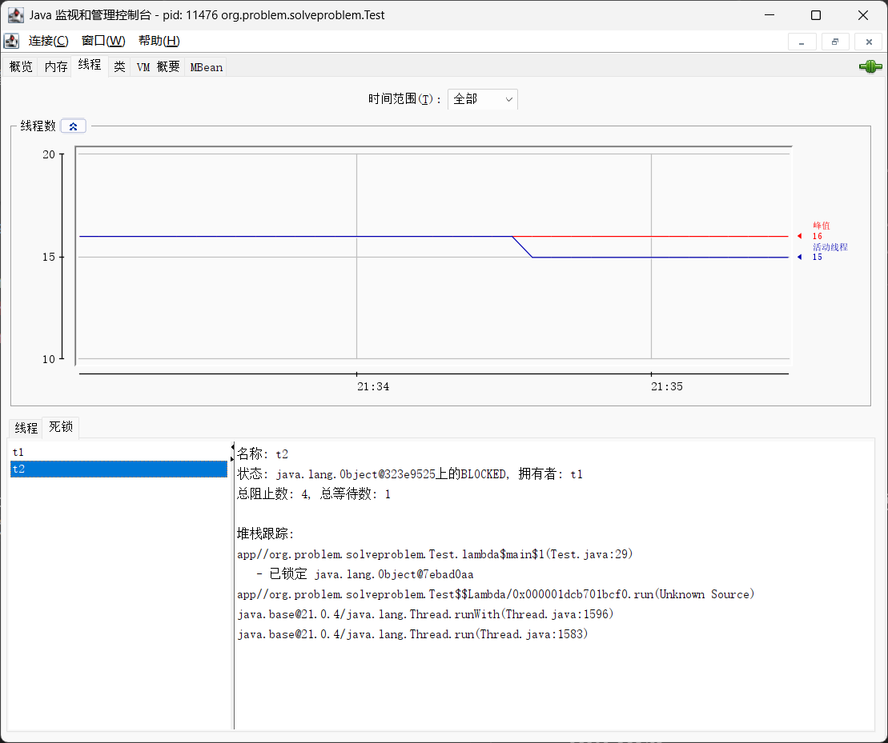
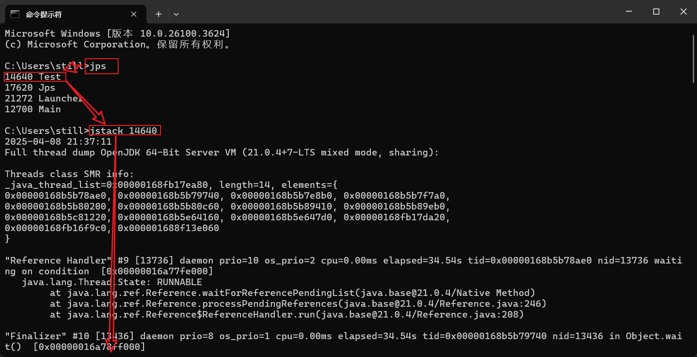

#### 哲学家就餐问题(死锁现象)
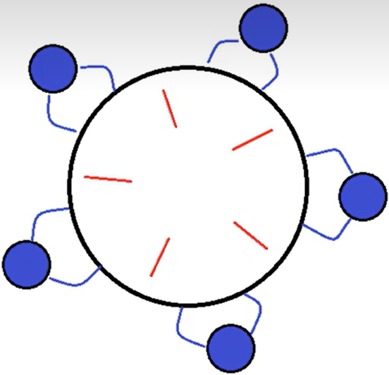
有五位哲学家，围坐在圆桌旁。
- 他们只做两件事，思考和吃饭，思考一会吃口饭，吃完饭接着思考。
- 吃饭时要用两根筷子吃，桌上共有 5 根筷子，每位哲学家左右手各有一根筷子。
- 如果筷子被身边的人拿着，自己就得等待
```java
@Slf4j(topic = "Test")
public class Test {
    public static void main(String[] args) {
        Chopstick c1 = new Chopstick("1");
        Chopstick c2 = new Chopstick("2");
        Chopstick c3 = new Chopstick("3");
        Chopstick c4 = new Chopstick("4");
        Chopstick c5 = new Chopstick("5");
        new Philosopher("苏格拉底", c1, c2).start();
        new Philosopher("柏拉图", c2, c3).start();
        new Philosopher("亚里士多德", c3, c4).start();
        new Philosopher("赫拉克利特", c4, c5).start();
        new Philosopher("阿基米德", c5, c1).start();
    }

    public static void sleep(long seconds) {
        try {
            Thread.sleep(seconds * 1000L);
        } catch (InterruptedException e) {
            throw new RuntimeException(e);
        }
    }
}

@Slf4j(topic = "Philosopher")
class Philosopher extends Thread {
    Chopstick left;
    Chopstick right;

    public Philosopher(String name, Chopstick left, Chopstick right) {
        super(name);
        this.left = left;
        this.right = right;
    }

    @Override
    public void run() {
        while (true) {
            // 尝试获得左筷子
            synchronized (left) {
                // 尝试获得右筷子
                synchronized (right) {
                    eat();
                }
            }
        }
    }

    private void eat() {
        log.info("eating..."); // 先吃饭
        Test.sleep(1); // 再思考
    }
}

class Chopstick {
    String name;

    public Chopstick(String name) {
        this.name = name;
    }

    @Override
    public String toString() {
        return "Chopstick{" + "name='" + name + '\'' + '}';
    }
}
```

### 活锁
活锁出现在两个线程互相改变对方的结束条件, 最后谁也无法结束, 例如:
```java
@Slf4j(topic = "Test")
public class Test {
    static volatile int count = 10;
    static final Object LOCK = new Object();

    public static void main(String[] args) {
        new Thread(() -> {
            while (count > 0) {
                sleep(1);
                count--;
                log.info("count = {}", count);
            }
        }, "t1").start();

        new Thread(() -> {
            while (count < 20) {
                sleep(1);
                count++;
                log.info("count = {}", count);
            }
        }, "t2").start();
    }

    public static void sleep(long seconds) {
        try {
            Thread.sleep(seconds * 1000L);
        } catch (InterruptedException e) {
            throw new RuntimeException(e);
        }
    }
}
```

### 饥饿
很多教程中把饥饿定义为, 一个线程由于优先级太低, 始终得不到CPU调度执行, 也不能够结束, 饥饿的情况不容易演示, 讲读写锁时会涉及饥饿问题

下面讲一个遇到的一个线程饥饿的例子, 先来看看使用顺序加锁的方式解决之前的死锁问题, 虽然能解决死锁, 但会造成线程饥饿

下面这个图是线程1获取A锁,然后获取B锁, 线程2获取B锁,然后获取A锁, 出现死锁
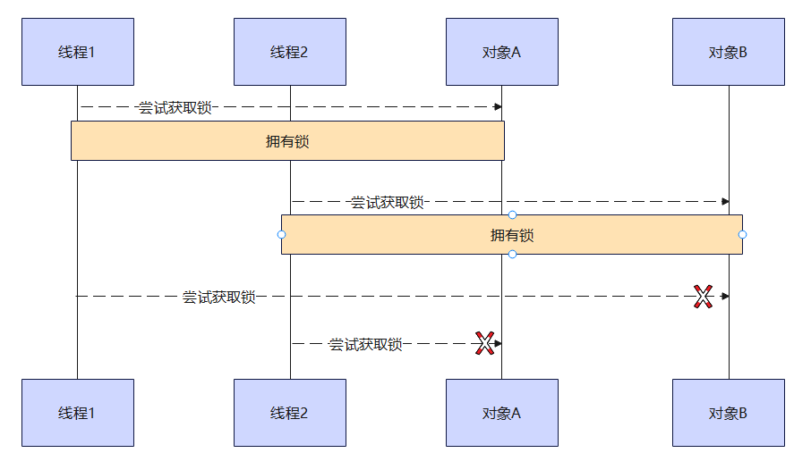

顺序加锁解决死锁, 线程1获取A锁,然后获取B锁, 线程2获取A锁,然后获取B锁
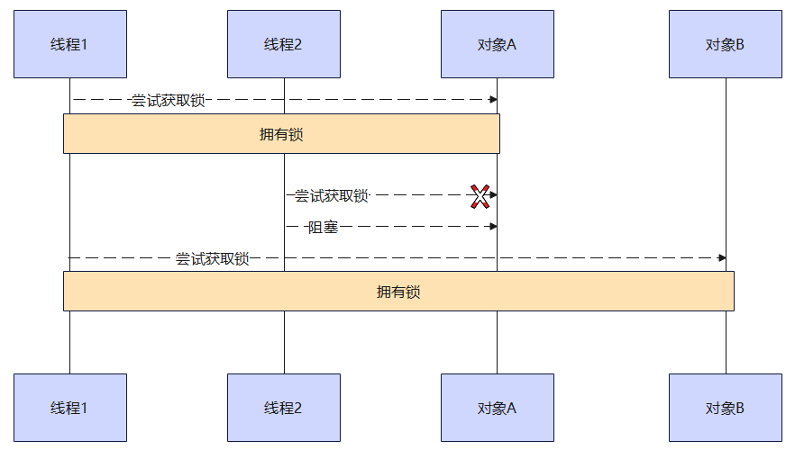

## 10.ReentrantLock
相对于synchronized它具有如下特点:
- 可中断
- 可以设置超时时间
- 可以设置为公平锁
- 支持多个条件变量

synchronized一样, 都支持可重入

基本语法
```java
// 获取锁
reentrantLock.lock();
try {
    // 临界区
} finally {
    // 释放锁
    reentrantLock.unlock();
}
```

### 可重入
可重入是指同一个线程如果首次获得了这把锁, 那么因为它是这把锁的拥有者, 因此有权利再次获取这把锁

如果是不可重入锁, 那么第二次获取锁时, 自己也会被锁挡住

```java
@Slf4j
public class Test {
    private static final ReentrantLock LOCK = new ReentrantLock();

    public static void main(String[] args) {
        LOCK.lock();
        try {
            log.info("enter main");
            m1();
        } finally {
            LOCK.unlock();
        }
    }

    public static void m1() {
        LOCK.lock();
        try {
            log.info("enter m1");
            m2();
        } finally {
            LOCK.unlock();
        }
    }

    public static void m2() {
        LOCK.lock();
        try {
            log.info("enter m2");
        } finally {
            LOCK.unlock();
        }
    }
}
```


