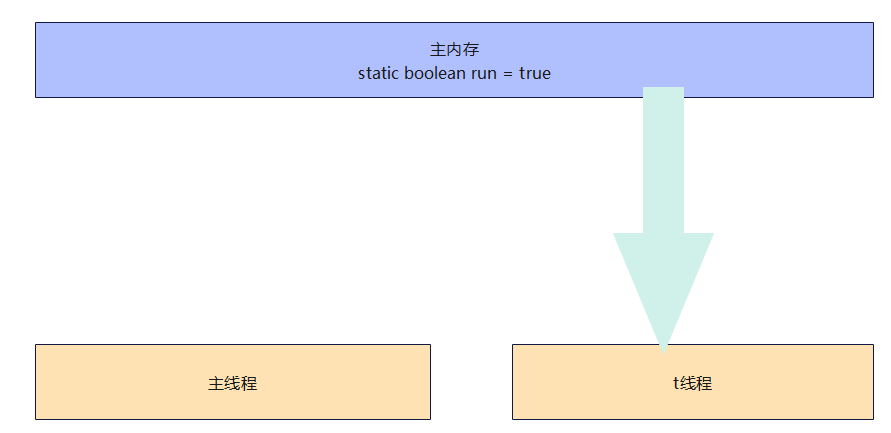
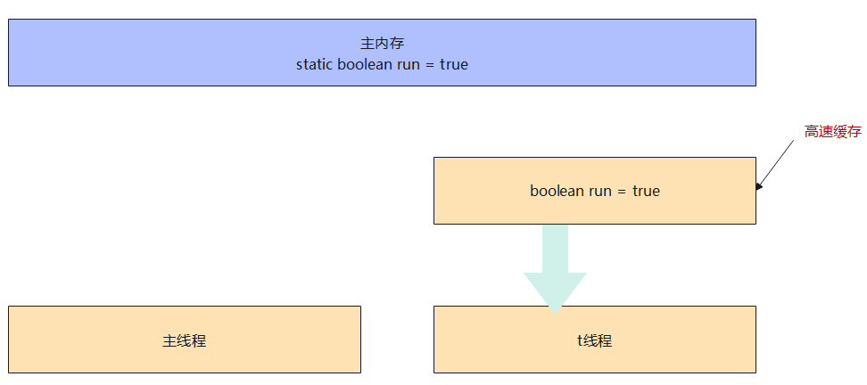
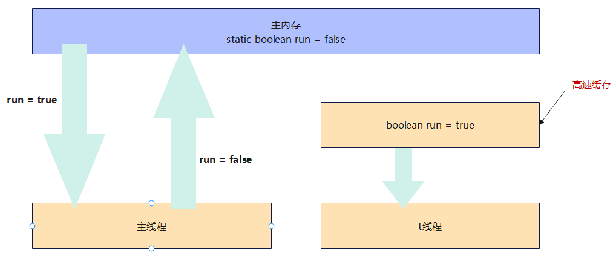

# 共享模型之内存
## 本章内容
上一章讲解的Monitor主要关注的是访问共享变量时，保证临界区代码的原子性  
这一章我们进一步深入学习共享变量在多线程间的可见性问题与多条指令执行时的有序性问题

## Java内存模型
JMM即Java Memory Model，它定义了主存，工作内存抽象概念，底层对应着CPU寄存器，缓存，硬件内存，CPU指令优化等  
JMM体现在以下几个方面  
- 原子性：保证指令不会受到线程上下文切换的影响
- 可见性：保证指令不会受到CPU缓存的影响
- 有序性：保证指令不会受到CPU指令并行优化的影响

## 可见性
### 退不出的循环
先来看一个现象，main线程对run变量的修改对于t线程不可见，导致了t线程无法停止：
```java
public class Test {
    static boolean run = true;

    public static void main(String[] args) throws InterruptedException {
        new Thread(() -> {
            while (run) {

            }
        }).start();

        Thread.sleep(1000);
        run = false;
    }
}
```
为什么呢？分析一下：
1. 初始状态，t线程刚开始从主内存读取了run的值到工作内存

2. 因为t线程要频繁从主内存中读取run的值，JIT编译器会将run的值缓存到自己工作内存中的高速缓存中，减少对主存中run的访问，提高效率

3. 1秒之后，main线程修改了run的值，并同步到主存，而t是从自己工作内存中的高速缓存中读取这个变量的值，结果永远是旧值


### 解决办法
#### volatile
它可以用来修饰成员变量和静态成员变量，它可以避免线程从自己的工作缓存中查找变量的值，必须到主存中获取它的值，线程操作volatile变量都是直接操作主存  

```java 
@Slf4j(topic = "Test")
public class Test {
    volatile static boolean run = true;

    public static void main(String[] args) throws InterruptedException {
        new Thread(() -> {
            while (run) {

            }
        }).start();

        Thread.sleep(1000);
        run = false;
    }
}
```
#### synchronized
```java 
@Slf4j(topic = "Test")
public class Test {
    static boolean run = true;
    // 锁对象
    final static Object lock = new Object();

    public static void main(String[] args) throws InterruptedException {
        new Thread(() -> {
            while (true) {
                synchronized (lock) {
                    if (!run) break;
                }
            }
        }).start();

        Thread.sleep(1000);
        synchronized (lock) {
            run = false;
        }
    }
}
```

### 可见性 vs 原子性
前面例子体现的实际就是可见性，它保证的是在多个线程之间，一个线程对volatile变量的修改对另一个线程可见，不能保证原子性，仅用在一个写线程，多个读线程的情况：  
上例从字节码理解是这样的：  
```ini
getstatic   run     //线程t获取run true
getstatic   run     //线程t获取run true
getstatic   run     //线程t获取run true
getstatic   run     //线程t获取run true
putstatic   run     //线程main修改run为false，仅此一次
getstatic   run     //线程t获取run false
```
比较以下之前我们将线程安全时举的例子：两个线程一个i++，一个i--，只能保证看到最新值，不能解决指令交错
```ini
//假设i的初始值为0
getstatic   i       // 线程2获取静态变量i的值，线程内i=0
getstatic   i       // 线程1获取静态变量i的值，线程内i=0
iconst_1            // 线程1准备常量1
iadd                // 线程1自增 线程内i=1
putstatic   i       // 线程1将修改后的值存入静态变量i 静态变量i=1
```
**注意**  
synchronized语句块既可以保证代码的原子性，同时也保证代码块内变量的可见性，但缺点是synchronized是属于重量级操作，性能相对更低