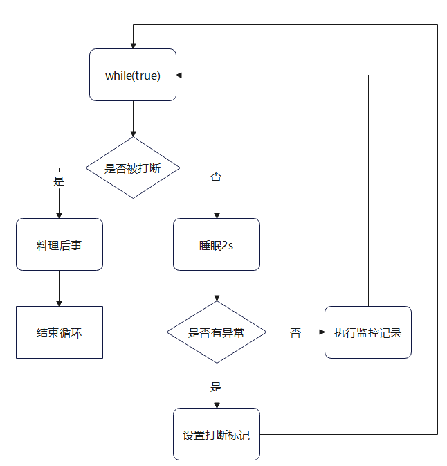
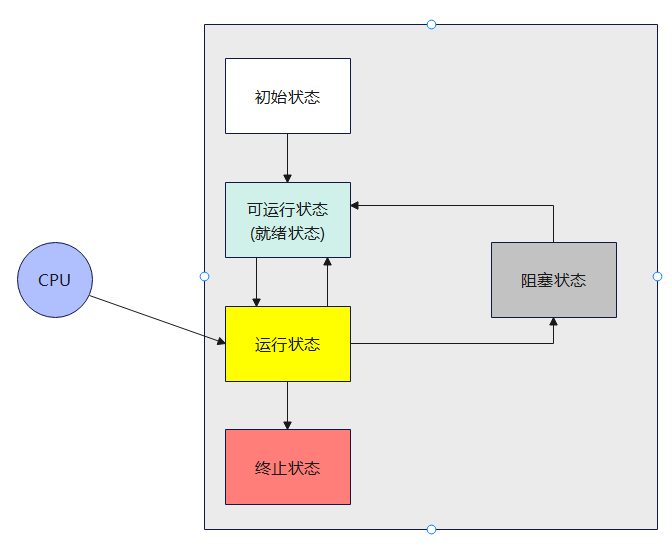
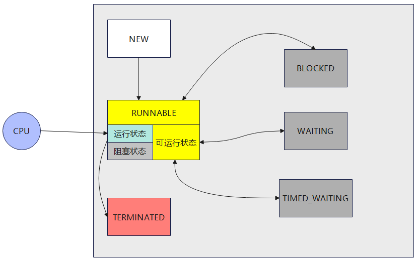

# 第三章 Java线程
## 3.1 创建和运行线程
### 方法一: 直接使用Thread
```Java
// 创建线程对象
Thread t = new Thread(){
    public void run() {
        // 要执行的任务
    }
}

// 启动线程
t.start();
```

### 方法二: 使用Runnable配合Thread
把<b>线程</b>和<b>任务</b>分开
- Thread代表线程
- Runnable可运行的任务(线程要执行的代码)
```java
Runnable runnable = new Runnable() {
    @Override
    public void run() {
        // 要执行的任务
    }
};

// 创建线程对象
Thread t = new Thread(runnable);
// 启动线程
t.start();
```

Thread和Runnable的关系<br>
分析Thread源码, 理清它与Runnable之间的关系<br>
小结:<br>
- 用Runnable更容易与线程池等高级API配合
- 用Runnable让任务类脱离了Thread继承体系, 更灵活

### 方法三: FutureTask配合Thread
FutureTask能够接收Callable类型的参数, 用来处理有返回结果的情况
```java
// 创建任务对象
FutureTask<Integer> task = new FutureTask<>(()-> {
    log.debug("hello");
    return 100;
});

// 参数1 是任务对象; 参数2 是线程名字, 推荐
new Thread(task, "名字").start();

// 主线程阻塞, 同步等待task执行完毕的结果
Integer result = task.get();
log.debug("结果是:{}", result);
```

## 3.2 查看进程线程的方法
### Linux
ps -fe 查看所有进程
ps -fT -p
### java
jps
jstack
jconsole

## 3.3 原理之线程运行
### 栈与栈帧
Java Virtual Machine Stacks(Java虚拟机栈)
我们都知道JVM中由堆,栈,方法区组成, 其中栈内存是给谁用的呢? 其实就是线程, 每个线程启动后, 虚拟机就会为其分配一块栈内存
- 每个栈由多个栈帧(Frame)组成, 对应着每次方法调用时所占用的内存
- 每个线程只能有一个活动栈帧, 对应着当前正在执行的方法
  
### 线程上下文切换(Thread Context Switch)
因为以下一些原因导致CPU不再执行当前的线程, 转而执行另一个线程的代码
- 线程的CPU时间片用完
- 垃圾回收
- 有更高优先级的线程需要运行
- 线程自己调用了sleep, yield, wait, join, park, synchronized, lock等方法

当Context Switch发生时, 需要由操作系统保存当前线程的状态, 并恢复另一个线程的状态, Java中对应的概念就是程序计数器(Program Counter Register), 它的作用是记住下一条jvm指令的执行地址, 是线程私有的

- 状态包括程序计数器, 虚拟机栈中每个栈帧的信息, 如局部变量, 操作数栈, 返回地址等
- Context Switch频繁发生会影响性能

## 3.4 常见方法
|方法名|功能说明|注意|
|--|--|--|
|start()|||
|run()|||
|join()|||
|join(long n)|||
|getId()|||
|getName()|||
|setName(String)|||
|getPriority()|||
|setPriority(int)|||
|getState()|||
|isInterrupted|||
|isAlive()|||
|interrupt()|||
|interrupted()|||
|currentThread()|||
|sleep(long)|||
|yield()|||

### start和run
start是线程开始, run是线程要执行的方法

### sleep和yield
sleep是线程从Running到TimeWaiting<br>
yield是线程从Running到Runnable

### 线程优先级
yield和设置优先级都不能完全控制线程, 最终还是由任务调度器决定线程是否执行, 只能是cpu繁忙的时候可以使用, cpu空闲时, 没有什么效果

### join
等待线程结束, 如果有参数, 就是有时效等待, 超时就不等了

### interrupt
可以打断<br>
阻塞状态的线程(sleep, wait, join)<br>
正在运行的线程

#### interrupt设计模式
两阶段终止模式(Two Phase Termination)<br>
在一个线程T1中如何"优雅"终止线程T2? 这里的"优雅"指的是给T2一个料理后事的机会

1. 错误思路<br>
   - 使用线程对象的stop()方法停止线程<br>
   stop方法会真正杀死线程, 如果这时线程锁住了共享资源, 那么当它被杀死后就再也没有机会释放锁, 其他线程将永远无法获取锁
   - 使用System.exit(int)方法停止线程<br>
    目的仅是停止一个线程, 但这种做法会让整个程序都停止
2. 两阶段终止模式
   
   ```java
   public class TwoPhaseTermination {
    private Thread monitor;

    // 启动监控线程
    public void start() {
        monitor = new Thread(()->{
            while (true) {
                Thread current = Thread.currentThread();
                if(current.isInterrupted()) {
                    log.debug("料理后事");
                    break;
                }
                try {
                    Thread.sleep(1000); // 情况1: 睡眠过程中被打断, 走catch
                    log.debug("执行监控记录"); // 情况2: 执行中被打断, 继续循环
                } catch (InterruptedException e) {
                    e.printStackTrace();
                    // 重新设置打断标记(sleep被打断时会清除打断标记, 所以需要重新打断)
                    current.interrupt();
                }
            }
        });
        monitor.start();
    }

    // 停止监控线程
    public void stop() {
        monitor.interrupt();
    }
   }
   ```

### park和interrupt

### 不推荐的方法(容易线程死锁)
stop, suspend, resume

## 3.5 主线程和守护线程
默认情况下, Java进程需要等待所有线程都运行结束, 才会结束. 有一种特殊的线程叫做守护线程, 只要其他非守护线程运行结束了, 即使守护线程的代码没有执行完, 也会强制结束

垃圾回收器线程就是一种守护线程<br>
Tomcat中的Acceptor和Poller线程都是守护线程, 所以Tomcat接收到shutdown命令后, 不会等待它们处理完当前请求

## 3.6 线程的状态
从操作系统层面描述(五种状态)


从JAVA API层面描述(六种状态)<br>
根据Thread.State枚举, 分为六种状态


## 小结
本章重点在于掌握
- 线程创建
- 线程重要api, 如start, run, sleep, join, interrupt等
- 线程状态
- 应用方面
  1. 异步调用: 主线程执行期间, 其他线程异步执行耗时操作
  2. 提高效率: 并行计算, 缩短计算时间
  3. 同步等待: join
  4. 统筹规划: 合理使用线程, 得到最优效果
- 原理方面
  1. 线程运行流程: 栈, 栈帧, 上下文切换, 程序计数器
  2. Thread两种创建方式的源码

- 模式方面: 两阶段终止 
