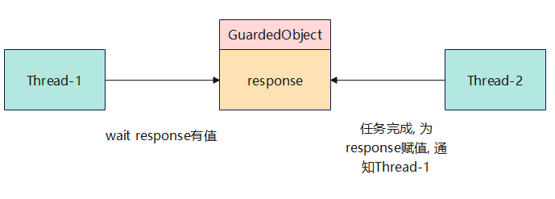
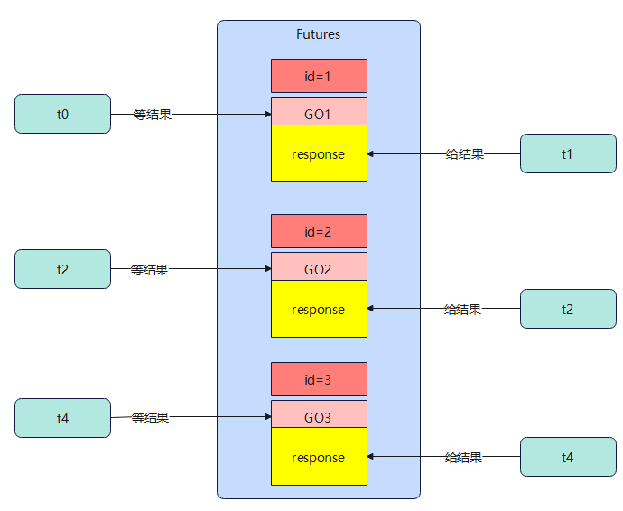

# 同步模式-保护性暂停
## 定义
Guarded Suspension, 用在一个线程等待另一个线程的执行结果

要点:
- 有一个结果需要从一个线程传递到另一个线程, 让他们关联同一个GuardedObject
- 如果有结果不断从一个线程到另一个线程那么可以使用消息队列(见生产者/消费者)
- JDK中, join的实现, Future的实现, 采用的就是这个模式
- 因为要等待另一方的结果, 因此归类到同步模式



## 代码实现
```java
public class GuardedObject {
    private Object response;

    public Object get() throws InterruptedException {
        synchronized (this) {
            while (response == null) {
                this.wait();
            }
            return response;
        }
    }

    public void complete(Object response) {
        synchronized (this) {
            this.response = response;
            this.notifyAll();
        }
    }
}

@Slf4j(topic = "Test")
class Test {
    public static void main(String[] args) {
        // 线程1 等待 线程2 的任务结果
        GuardedObject guardedObject = new GuardedObject();
        new Thread(() -> {
            log.info("等待结果");
            List<String> response;
            try {
                response = (List<String>) guardedObject.get();
            } catch (InterruptedException e) {
                throw new RuntimeException(e);
            }
            log.info("结果的大小:[{}]", response.size());
        }, "t1").start();

        // 线程2执行任务
        new Thread(() -> {
            log.info("执行任务");
            List<String> list = new ArrayList<>();
            for (int i = 0; i < new Random().nextInt(10); ++i) list.add(String.valueOf(i));
            guardedObject.complete(list);
        }).start();
    }
}
```

## 代码扩展-增加超时
注意get方法的waitTime写法, 超时时间的计算
```java
public class GuardedObject {
    private Object response;

    // timeout表示要等待多久
    public Object get(long timeout) throws InterruptedException {
        synchronized (this) {
            // 记录开始时间
            long begin = System.currentTimeMillis();
            // 记录经历的时间
            long passTime = 0;
            while (response == null) {
                long waitTime = timeout - passTime;
                if (waitTime <= 0) break;
                this.wait(waitTime);
                // 求得经历时间
                passTime = System.currentTimeMillis() - begin;
            }
            return response;
        }
    }

    public void complete(Object response) {
        synchronized (this) {
            this.response = response;
            this.notifyAll();
        }
    }
}

@Slf4j(topic = "Test")
class Test {
    public static void main(String[] args) {
        // 线程1 等待 线程2 的任务结果
        GuardedObject guardedObject = new GuardedObject();
        new Thread(() -> {
            log.info("等待结果");
            List<String> response;
            try {
                response = (List<String>) guardedObject.get(1);
            } catch (InterruptedException e) {
                throw new RuntimeException(e);
            }
            log.info("结果是{}", response);
        }, "t1").start();

        // 线程2执行任务
        new Thread(() -> {
            log.info("执行任务");
            List<String> list = new ArrayList<>();
            for (int i = 0; i < new Random().nextInt(10); ++i) list.add(String.valueOf(i));
//            try {
//                Thread.sleep(2);
//            } catch (InterruptedException e) {
//                throw new RuntimeException(e);
//            }
            guardedObject.complete(list);
        }, "t2").start();
    }
}
```

join方法就是保护性暂停的一种应用
```java
public final void join(long millis) throws InterruptedException {
    if (millis < 0)
        throw new IllegalArgumentException("timeout value is negative");

    if (this instanceof VirtualThread vthread) {
        if (isAlive()) {
            long nanos = MILLISECONDS.toNanos(millis);
            vthread.joinNanos(nanos);
        }
        return;
    }

    synchronized (this) {
        if (millis > 0) {
            if (isAlive()) {
                final long startTime = System.nanoTime();
                long delay = millis;
                do {
                    wait(delay);
                } while (isAlive() && (delay = millis -
                    NANOSECONDS.toMillis(System.nanoTime() - startTime)) > 0);
                }
        } else {
            while (isAlive()) {
                wait(0);
            }
        }
    }
}
```
## 代码扩展-解耦等待和生产

图中Future就好比居民楼一层的信箱(每个信箱有房间编号), 左侧的t0, t2, t4就好比等待邮件的居民, 右侧的t1, t3, t5就好比邮递员

如果需要多个类之间使用GuardedObject对象, 作为参数传递不是很方便, 因此设计一个用来解耦的中间类, 这样不仅能够解耦<font color=pink>结果等待者</font>和<font color=pink>结果生产者</font>, 还能够同时支持多个任务的管理

以下代码模拟了通过邮箱类让邮递员类送信和居民类收信的过程, 一对一的模式
```java
@Slf4j(topic = "People")
class People extends Thread {
    @SneakyThrows
    @Override
    public void run() {
        // 收信
        GuardedObject go = MailBoxes.createGuardedObject();
        log.info("开始收信 id:{}", go.getId());
        Object mail = go.get(5000);
        log.info("收到信 id:{}, 内容:{}", go.getId(), mail);
    }
}

@Slf4j(topic = "Postman")
class Postman extends Thread {
    private final int id;
    private final String mail;

    public Postman(int id, String mail) {
        this.id = id;
        this.mail = mail;
    }

    @Override
    public void run() {
        GuardedObject go = MailBoxes.getGuardedObject(id);
        log.info("送信 id = {}, 内容={}", id, mail);
        go.complete(mail);
    }
}

class MailBoxes {
    private static final Map<Integer, GuardedObject> boxes = new Hashtable<>();
    private static int id = 1;

    // 产生唯一id
    private static synchronized int generateId() {
        return id++;
    }

    public static GuardedObject getGuardedObject(int id) {
        return boxes.remove(id);
    }

    public static GuardedObject createGuardedObject() {
        GuardedObject go = new GuardedObject(generateId());
        boxes.put(go.getId(), go);
        return go;
    }

    public static Set<Integer> getIds() {
        return boxes.keySet();
    }
}

public class GuardedObject {
    // 唯一标识 Guarded Object
    private int id;

    public GuardedObject(int id) {
        this.id = id;
    }

    public int getId() {
        return id;
    }


    private Object response;

    // timeout表示要等待多久
    public Object get(long timeout) throws InterruptedException {
        synchronized (this) {
            // 记录开始时间
            long begin = System.currentTimeMillis();
            // 记录经历的时间
            long passTime = 0;
            while (response == null) {
                long waitTime = timeout - passTime;
                if (waitTime <= 0) break;
                this.wait(waitTime);
                // 求得经历时间
                passTime = System.currentTimeMillis() - begin;
            }
            return response;
        }
    }

    public void complete(Object response) {
        synchronized (this) {
            this.response = response;
            this.notifyAll();
        }
    }
}

@Slf4j(topic = "Test")
class Test {
    public static void main(String[] args) throws InterruptedException {
        for (int i = 0; i < 3; i++) {
            new People().start();
        }
        Thread.sleep(1000);
        for (Integer id : MailBoxes.getIds()) {
            new Postman(id, "内容" + id).start();
        }
    }
}
```

