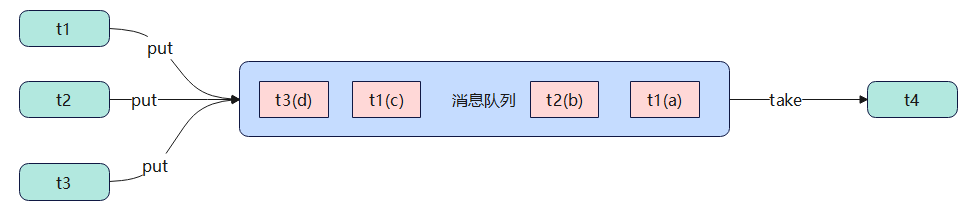

# 异步模式-生产者消费者
## 定义
- 与保护性暂停中的GuardedObject不同, 不需要产生结果和消费结果的线程一一对应
- 消费队列可以用来平衡生产和消费的线程资源
- 生产者仅负责产生结果数据, 不关心数据如何处理, 而消费者专心处理结果数据
- 消息队列是有容量限制的, 满时不会再加入数据, 空时不会再消耗数据
- JDK中各种阻塞队列, 采用的就是这种模式



## 代码实现
```java
// 消息
final class Message {
    private final int id;
    private final Object value;

    public Message(int id, Object value) {
        this.id = id;
        this.value = value;
    }

    public int getId() {
        return id;
    }

    public Object getValue() {
        return value;
    }

    @Override
    public String toString() {
        return "Message{" +
                "id=" + id +
                ", value=" + value +
                '}';
    }
}

@Slf4j(topic = "MessageQueue")
// 消息队列类 - java线程之间通信
final class MessageQueue {
    // 消息的队列集合
    private final LinkedList<Message> list = new LinkedList<>();
    // 队列的容量
    private final int capacity;

    public MessageQueue(int capacity) {
        this.capacity = capacity;
    }

    // 获取消息的方法
    public Message take() {
        // 检查队列是否为空
        synchronized (list) {
            while (list.isEmpty()) {
                try {
                    log.info("队列为空, 消费者线程等待");
                    list.wait();
                } catch (InterruptedException e) {
                    throw new RuntimeException(e);
                }
            }
            // 从队列的头部获取消息返回
            Message message = list.removeFirst();
            log.info("已消费消息: {}", message);
            list.notifyAll();
            return message;
        }
    }

    // 存入消息的方法
    public void put(Message message) {
        synchronized (list) {
            // 检查队列是否已满
            while (list.size() == capacity) {
                try {
                    log.info("队列已满, 生产者线程等待");
                    list.wait();
                } catch (InterruptedException e) {
                    throw new RuntimeException(e);
                }
            }
            // 将消息加入队列尾部
            list.addLast(message);
            log.info("已生产消息: {}", message);
            list.notifyAll();
        }
    }
}

@Slf4j(topic = "Test")
public class Test {
    public static void main(String[] args) {
        MessageQueue queue = new MessageQueue(2);
        for (int i = 0; i < 3; i++) {
            int id = i;
            new Thread(() -> queue.put(new Message(id, "值" + id)), "producer-" + i).start();
        }

        new Thread(() -> {
            while (true) {
                try {
                    Thread.sleep(1);
                } catch (InterruptedException e) {
                    throw new RuntimeException(e);
                }
                Message message = queue.take();
                // 拿到消息进行业务处理
            }
        }, "consumer").start();
    }
}
```